#### 一、目标检测综述

##### 1、什么是目标检测？
**目标检测** 的任务是找出图像中所有感兴趣的目标（物体），确定它们的位置和大小，是机器视觉领域的核心问题之一。由于各类物体有不同的外观，形状，姿态，加上成像时光照，遮挡等因素的干扰，目标检测一直是机器视觉领域最具有挑战性的问题。

计算机视觉中关于图像识别有四大类任务：

 1. 分类-Classification：解决“是什么？”的问题，即给定一张图片或一段视频判断里面包含什么类别的目标。
 2. 定位-Location：解决“在哪里？”的问题，即定位出这个目标的的位置。
 3. 检测-Detection：解决“是什么？在哪里？”的问题，即定位出这个目标的的位置并且知道目标物是什么。
 4. 分割-Segmentation：分为实例的分割（Instance-level）和场景分割（Scene-level），解决“每一个像素属于哪个目标物或场景”的问题。

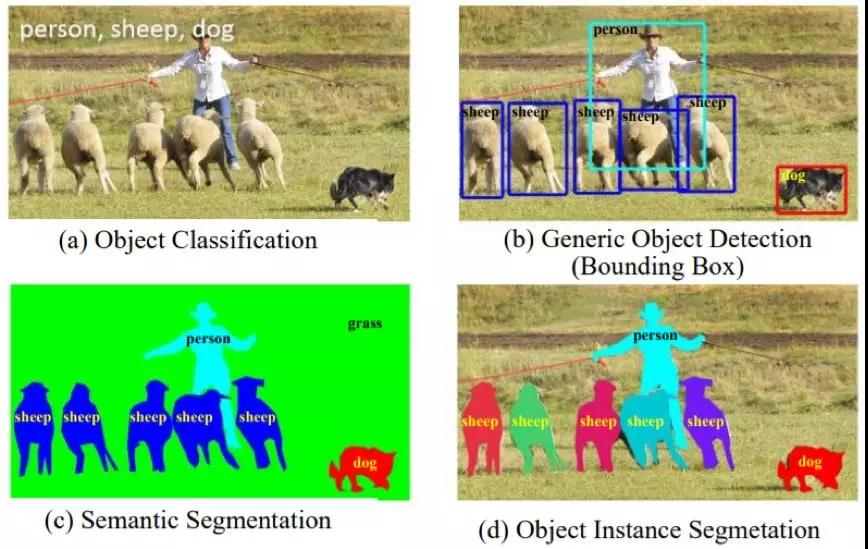

##### 2、目标检测要解决的核心问题
除了图像分类之外，目标检测要解决的核心问题是：

 1. 目标可能出现在图像的任何位置。
 2. 目标有各种不同的大小。
 3. 目标可能有各种不同的形状。
 
如果用矩形框来定义目标，则矩形有不同的宽高比。由于目标的宽高比不同，因此采用经典的滑动窗口+图像缩放的方案解决通用目标检测问题的成本太高。

##### 3、目标检测最新进展

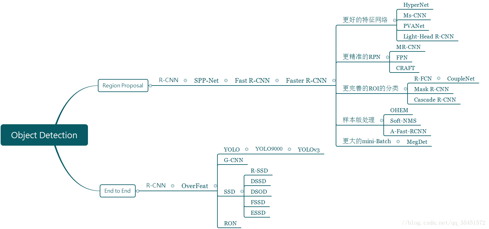

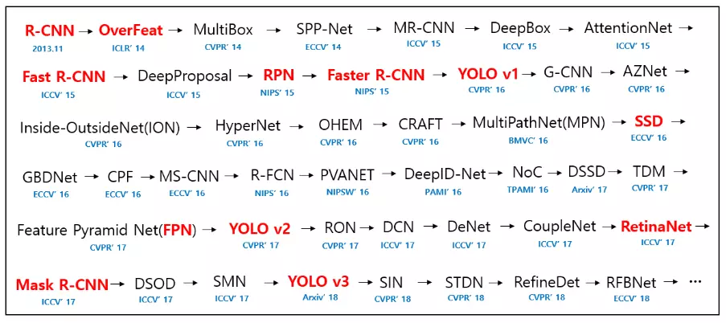


##### 4、主要难题


#### 二、传统方法

##### 1、滑窗法
滑动窗口检测器是一种暴力检测方法，从左到右，从上到下滑动窗口，然后利用分类识别目标。这里使用不同大小的窗口，因为一张图片可能展示从不同距离观测检测出不同的目标类型。首先来看一下滑窗法的物体检测流程图：

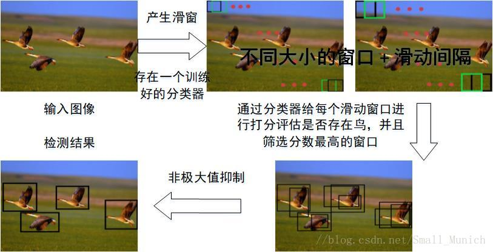

　　通过滑窗法流程图可以很清晰理解其主要思路：首先对输入图像进行不同窗口大小的滑窗进行从左往右、从上到下的滑动。每次滑动时候对当前窗口执行分类器(分类器是事先训练好的)。如果当前窗口得到较高的分类概率，则认为检测到了物体。对每个不同窗口大小的滑窗都进行检测后，会得到不同窗口检测到的物体标记，这些窗口大小会存在重复较高的部分，最后采用非极大值抑制(Non-Maximum Suppression, NMS)的方法进行筛选。最终，经过NMS筛选后获得检测到的物体。
  
  滑动窗口从图像中可能剪切出不同大小的图像块，但是很多分类器只取固定大小的图像，所以这些图像是经过变形转换的。但是这样做并不影响准确率，因为分类器可以处理变形后的图像。 变形图像被输入到CNN中，提取4096个特征，然后使用SVM和一个线性分类器来识别分类和边界框。
  
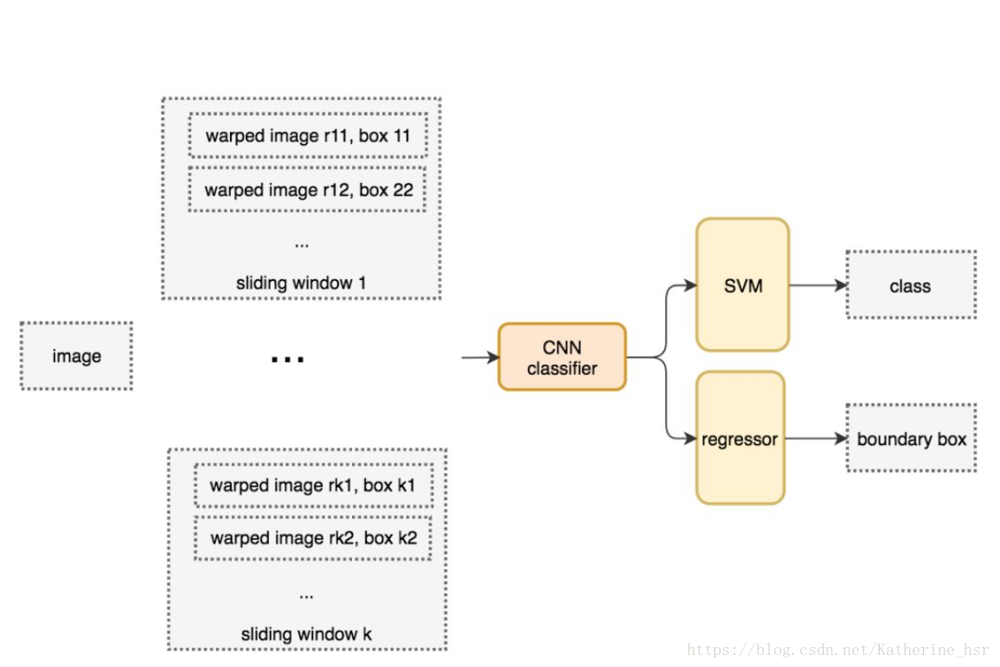
  
　　滑窗法简单易于理解，但是不同窗口大小进行图像全局搜索导致效率低下，而且设计窗口大小时候还需要考虑物体的长宽比。所以，对于实时性要求较高的分类器，不推荐使用滑窗法。 
　　 
##### 2、Region Proposal方法

Region Proposal方法比传统的滑动窗口方法获取的质量要更高。对一幅图像上进行Region Proposal提取目前存在许多方法: 例如Objectness、Selective Search、Category-independent object proposals、Constrained parametric min-cuts(CPMC)等。比较常用的Region Proposal方法有：SelectiveSearch(SS，选择性搜索)、Edge Boxes（EB）。

基于Region Proposal目标检测算法的步骤如下：


其中边框回归（Bouding Box Regression）：是对RegionProposal进行纠正的线性回归算法，目的是为了让Region Proposal提取到的窗口与目标窗口（Ground Truth）更加吻合。

###### （1）、SelectiveSearch(SS，选择性搜索)

为了在滑动窗口检测器的基础上提高搜索速度，可以采用候选区域方法(region proposal method)创建目标检测的感兴趣区域(ROI)。在选择性搜索中，首先将每个像素作为一组，然后计算每一组的纹理，将两个最接近的组结合起来，我们通常对较小的组先分组，合并区域知道所有区域都合并在一起。看一下选择搜索的物体检测流程图：

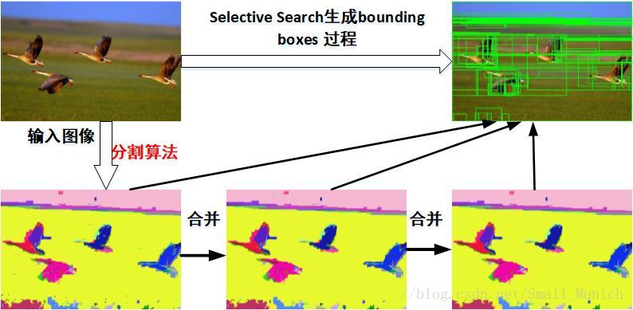

　　滑窗法类似穷举进行图像子区域搜索，但是一般情况下图像中大部分子区域是没有物体的。学者们自然而然想到只对图像中最有可能包含物体的区域进行搜索以此来提高计算效率。选择搜索方法是当下最为熟知的图像bouding boxes提取算法，由Koen E.A于2011年提出，具体详见论文。下面大致说一下选择搜索算法的过程：
　　选择搜索算法的主要观点：图像中物体可能存在的区域应该是有某些相似性或者连续性区域的。因此，选择搜索基于上面这一想法采用子区域合并的方法进行提取bounding boxes候选边界框。首先，对输入图像进行分割算法产生许多小的子区域。其次，根据这些子区域之间相似性(相似性标准主要有颜色、纹理、大小等等)进行区域合并，不断的进行区域迭代合并。每次迭代过程中对这些合并的子区域做bounding boxes(外切矩形)，这些子区域外切矩形就是通常所说的候选框。

选择搜索优点： 
 1. 计算效率优于滑窗法。 
 2. 由于采用子区域合并策略，所以可以包含各种大小的疑似物体框。 
 3. 合并区域相似的指标多样性，提高了检测物体的概率。

###### （2）、Edge Boxes（EB）

**论文《Edge Boxes: Locating Object Proposals from Edges》**

利用边缘信息（Edge），确定框框内的轮廓个数和与框框边缘重叠的轮廓个数（这点很重要，如果我能够清楚的知道一个框框内完全包含的轮廓个数，那么目标有很大可能性，就在这个框中），并基于此对框框进行评分，进一步根据得分的高低顺序确定proposal信息（由大小，长宽比，位置构成）。而后续工作就是在proposal内部运行相关检测算法。

下面试着详细介绍本文算法流程：

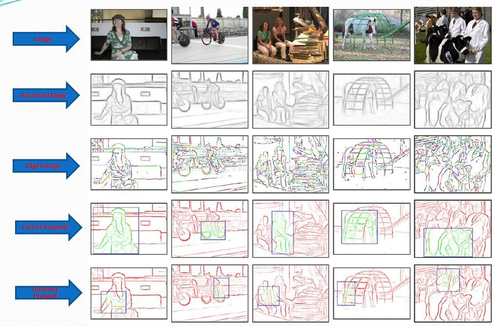

首先，第一行是原图，第二行是基于文献《Structured Forests for Fast Edge Detection》所提出的结构化边缘检测算法，得到的边缘图像，这时的边缘图像显得很紧密，需要用NMS进一步处理得到一个相对稀疏的边缘图像。

其次，第三行中，本来灰色的边缘变成了五颜六色的边缘，其实这些五颜六色的边缘是基于某种策略，将边缘点集合起来得到的 N 多个小段，论文中，叫做 edge group。所采用的的策略是：将近乎在一条直线上的边缘点，集中起来形成一个edge group，具体的做法是，不停地寻找8连通的边缘点，直到两两边缘点之间的方向角度差值的和大于 `!$\pi/2$`，这样便得到了 `!$N$` 多个edge group。

再其次，得到 `!$N$` 个edge group之后，还要进一步计算两两edge group之间的相似度，相似度的公式很简单，如下：

```mathjax!
$$
a(s_i,s_j) = |cos(\theta_i - \theta_{ij})cos(\theta_j - \theta_{ij})|^{\gamma}
$$
```

这样变使得，如果两个edge group越在一条直线上，上述公式计算得到的相似度就越高，反之亦然。作者之所以引入edge group概念，是为了确定轮廓个数做准备，因为一个轮廓中的所有edge group当然是最相似的，这点可以在纸上画画，十分明显。

最后，让我们看看作者是怎么根据edge group来确定轮廓的。作者的做法在我看起来很奇葩，他给每一个edge group一个权值，换句话说，打个分数，然后把权值均为1的edge group归为框框内轮廓上的一部分，把权值为0的edge group归为框框外或者与框框边界重叠的轮廓的一部分。采用了一个数学公式达到了上述目的，如下：

```mathjax!
$$
w_b(s_i) = 1 - max_{T} \prod_j^{|T| - 1} a(t_j,t_{j+1})
$$
```

其中，T 是指从框框的边缘开始到达 `!$s_i$` 的edge group序列集合，当然，会有很多个 T，看到没，它的目标就是从这么多的路径T中，寻找相似度最高的路径，这就是传说中的轮廓。值得注意的是，在某路径 T上，一旦出现相似度为 0（这很容易出现）的情况，这条路径 T 就废弃了，所以想找到那个合适的 T，真的很快。

Edgebox进行目标检测的思路为：首先利用结构化的方法检测出边缘，并利用非极大值抑制对边缘进行筛选；然后基于某种策略将似乎在一条直线上的边缘点集合成若干个edge group，并计算edge group之间的相似度，越是在同一直线上的edge group，其相似度越高。再通过edge group来确定轮廓数，实现策略为给每个edge group计算一个权值，将权值为1的edge group归为proposal内轮廓上的一部分，将权值为 0 的edge group归为proposal外或proposal框重叠的一部分，由此便提取得到proposal，并对proposal进行评分，选取得分最高的proposal作为最后的检测输出。但是该算法有一个明显的缺陷是当一幅图像中包含多个相同的检测目标时，其得分最高的proposal几乎包含整幅图像，而不是单独的目标。原因在于，其不是基于“学习”的算法，没有训练的过程，也就没有具体的针对目标的模型，故这使得其在进行单一类别多目标检测时效果不佳。

#### 三、框架
从人工设计特征到学习 DCNN 特征，用于识别的目标特征表示和分类器一直以来都在稳步发展。相对而言，用于定位的基本「滑动窗口」策略仍还是主流，尽管 [113, 209] 也做出了一些努力。但是窗口的数量很大，而且会随像素数量呈二次增长，而且搜索多个尺度和宽高比的需求还会进一步增大搜索空间。巨大的搜索空间会导致高度的计算复杂度。因此，有效且高效的检测框架设计具有关键性作用。经常采用的策略包括级联、共享特征计算和降低每个窗口的计算量。过去几年中提出的几乎所有检测器都基于其中一种里程碑检测器，试图在一个或多个方面实现改进。整体而言，这些检测器可以分为两大主要类别：

1.	两级式检测框架，包含一个用于区域提议的预处理步骤，使得整体流程是两级式的。
2.	单级式检测框架，即无区域提议的框架，这是一种单独提出的方法，不会将检测提议分开，使得整个流程是单级式的。


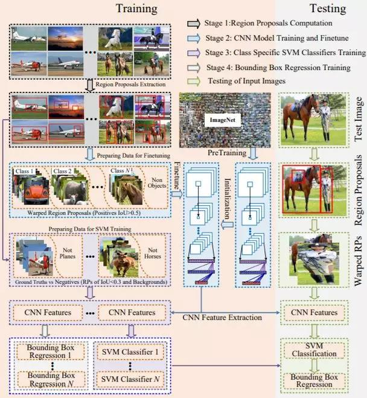

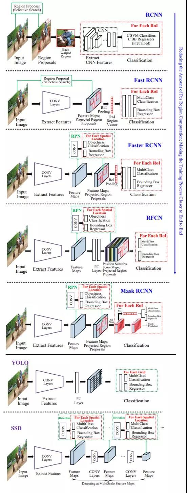

#### 四、基础性子问题
###### 1、基于 DCNN 的目标表示

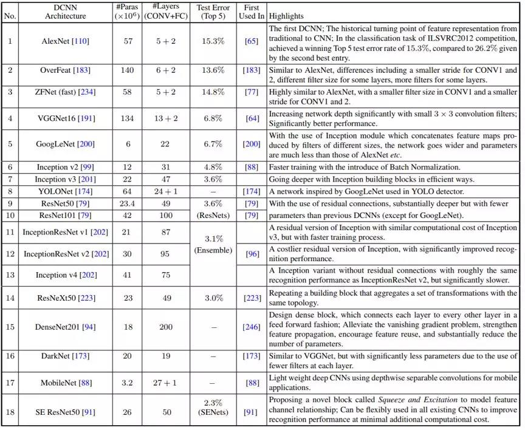

对于 #Paras 和 #Layers 的统计数据，没有考虑最后的 FC 预测层。「Test Error」一列给出了在 ImageNet1000 上的 Top 5 分类测试误差。解释：OverFeat（准确的模型）、DenseNet201（Growth Rate 32, DenseNet-BC）以及 ResNeXt50（32\*4d）。


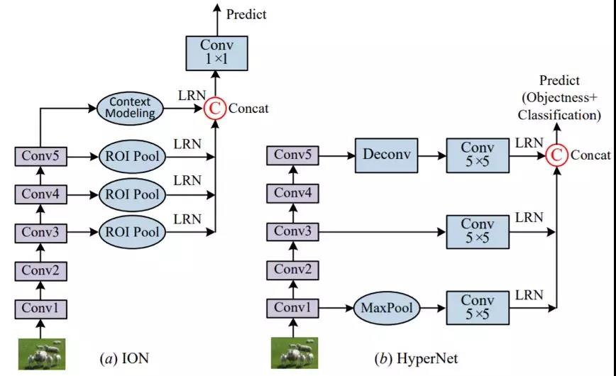

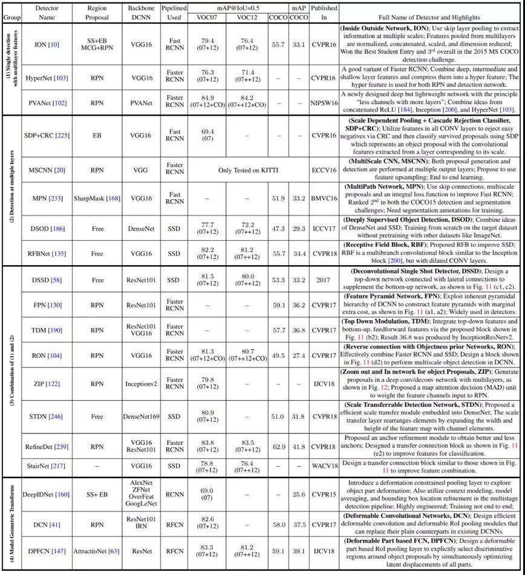

缩写：Selective Search（SS）、EdgeBoxes（EB）、InceptionResNet（IRN）。mAP@IoU=0.5 时，在 VOC07、VOC12 和 COCO 上报告的检测结果；另一列在 COCO 上的结果是在一个新指标 mAP@IoU=\[0.5 : 0.05 : 0.95] 上报告的，这是在从 0.5 到 0.95（写成 \[0.5:0.95]）的不同 IoU 阈值上平均求取 mAP。训练数据：07 表示 VOC2007 trainval，12 表示 VOC2012 trainval，07+12 表示 VOC07 和 VOC12 trainval 的并集。COCO 检测结果是在 COCO2015 Test-Dev 上报告的，只有 MPN  除外，其结果基于 COCO2015 Test-Standard。

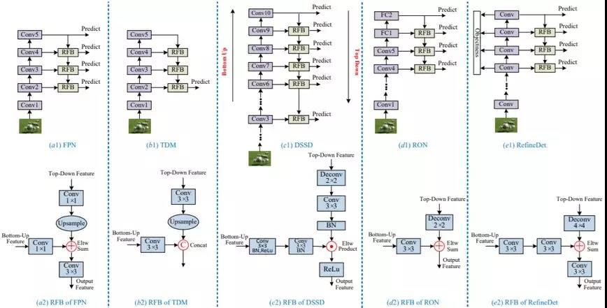

###### 2、形境建模
在物理世界中，视觉目标通常会出现在特定的环境中，并且通常与其它相关目标共同存在，而且有强大的心理学证据表明形境在人类目标识别中发挥着关键性的作用。人们也认识到对形境适当建模有助于目标检测和识别，尤其是当目标尺寸过小、存在遮挡或图像质量差等原因造成目标外观特征不充分时。已有研究者探讨了很多不同类型的形境，形境大致可分为这三大类：

1.	形义形境：目标出现在某些场景而非其它场景中的可能性；
2.	空间形境：在场景中目标与其它物体存在某些位置关系而非其它位置关系的可能性；
3.	尺寸形境：在场景中目标相对其它物体所存在的尺寸限制。

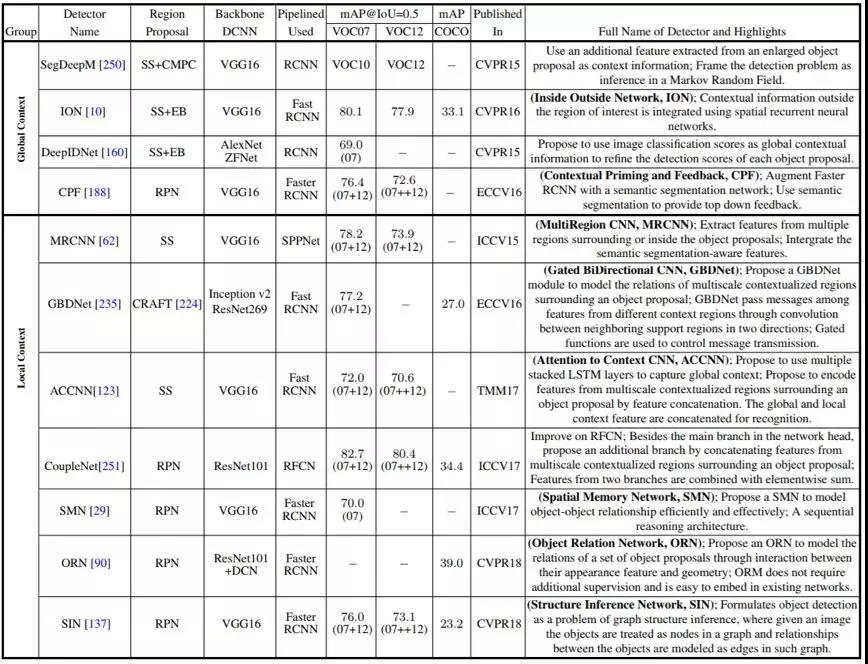

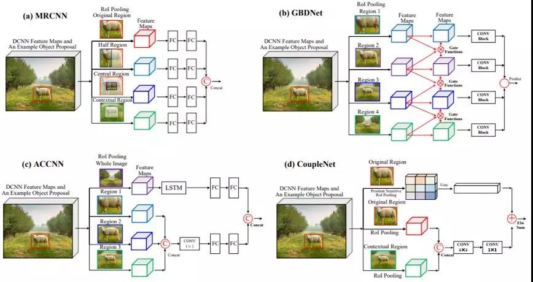

###### 3、检测提议方法
检测提议（detection proposal）通常被用作一个预处理步骤，以通过限制需要检测器评估的区域的数量来降低计算的复杂性。因此，一个优良的检测提议应当具备以下特点：

1.	高召回率，只使用少量提议就可以实现；
2.	提议尽可能准确地匹配目标；
3.	高效率。

![使用 DCNN 的目标提议方法汇总。蓝色数字表示目标提议的数量。除非另有说明，在 COCO 上的检测结果都使用了 mAP@IoU[0.5, 0.95]](./images/114.jpg)

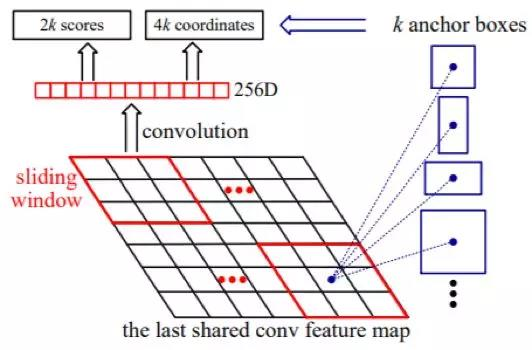

###### 4、特殊问题

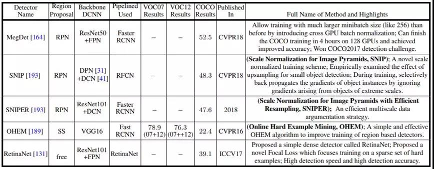

#### 五、数据集和表现评估

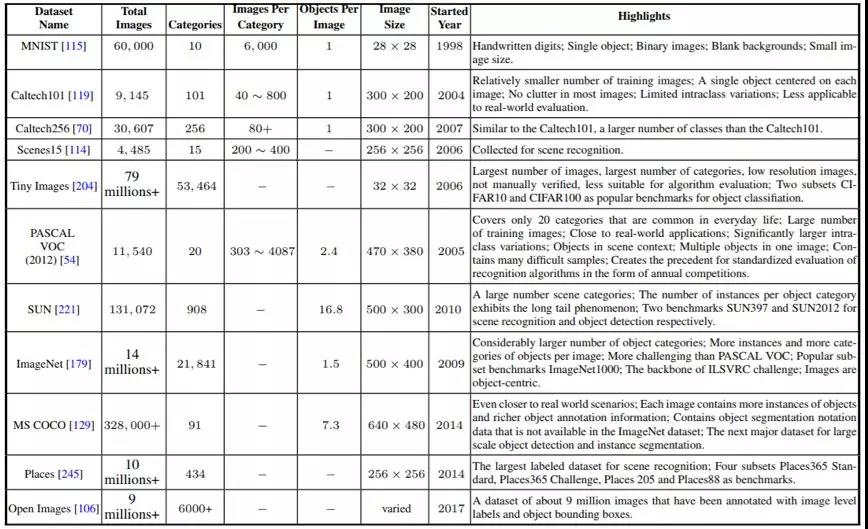

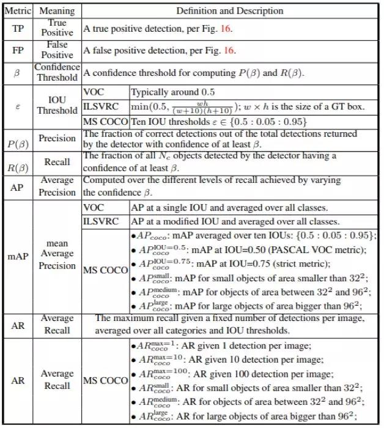

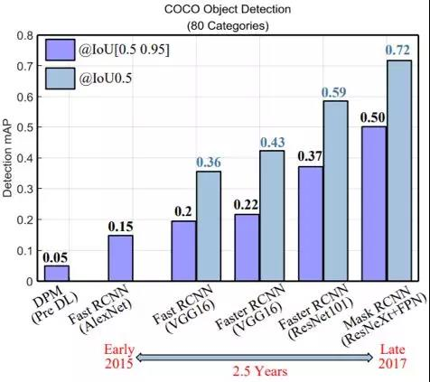

在检测中，主干网络、检测器框架的设计和优质的大规模数据集是最重要的三大要素。

#### 六、开源代码库

按照时间线来说，从Detectron到maskrcnn-benchmark到mmdetection到detectron2。Detectron是基于caffe2写的，其余都是Pytorch。

 1. Detectron 链接：https://github.com/facebookresearch/Detectron；
 2. maskrcnn-benchmark 链接：https://github.com/facebookresearch/maskrcnn-benchmark；
 3. mmdetection 链接：https://github.com/open-mmlab/mmdetection；
 4. detectron2 链接：https://github.com/facebookresearch/detectron2。

#### 七、总结
尽管过去几年取得了巨大的成功（比如检测准确度从 ILSVRC2013 的 23% 显著提升至了 ILSVRC2017 的 73%），但当前最佳方法的表现与人类水平仍有巨大差距，尤其是在开放世界学习任务上。还有很多研究工作有待完成，我们可以看到研究者的关注重点主要集中在以下八个领域：

1.	开放世界学习
2.	更好更高效的检测框架
3.	紧凑高效的深度 CNN 特征
4.	稳健的目标表征
5.	形境推理
6.	目标实例分割
7.	弱监督或无监督学习
8.	三维目标检测
