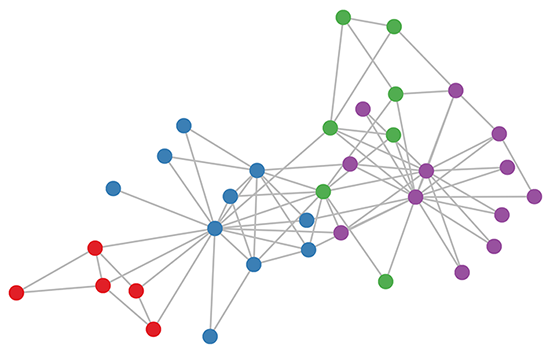
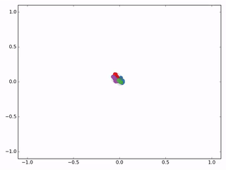
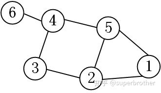
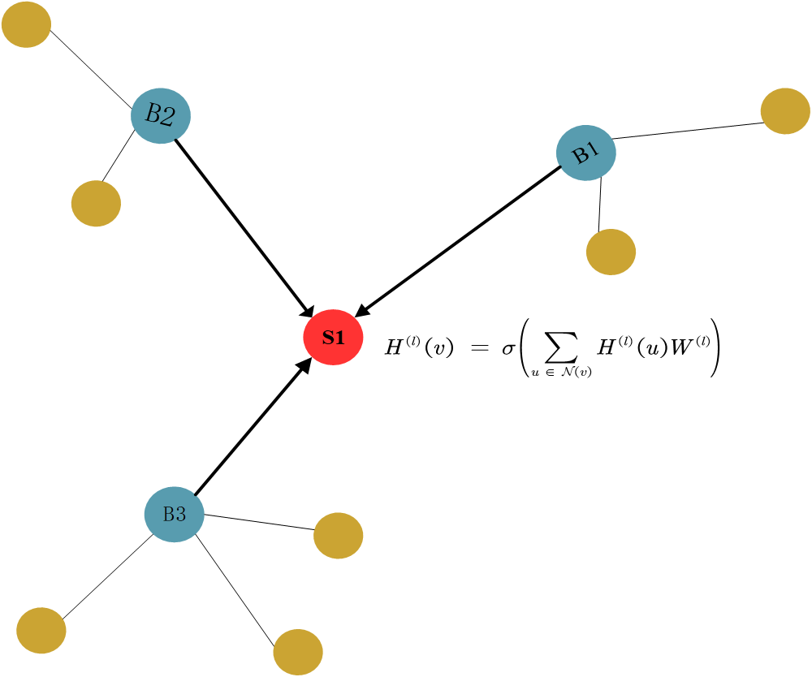

[TOC]

### 7、 GCN(Graph Convolutional Network)

Deep learning 中的Graph Convolution直接看上去会和第5节推导出的图卷积公式有很大的不同，但是万变不离其宗，都是根据下式来推导的：
```mathjax!
$$
g_\theta * x = Ug_\theta U^Tx =U\left(\begin{matrix}\hat g(\lambda_1) &amp; \\&amp;\ddots \\ &amp;&amp;\hat g(\lambda_n) \end{matrix}\right) U^T x  \tag{3}
$$
```
上式计算量很大，因为特征向量矩阵 `!$U$` 的复杂度是 `!$O(N^2)$`。此外，对于大型图来说，L特征值分解的计算量也很大。
  
##### 7.1、GCN的演变——卷积参数

Deep learning 中的 Convolution 就是要设计含有 trainable 共享参数的kernel，从上式看很直观：graph convolution 中的卷积参数就是 `!$diag(\hat h(\lambda_l) )$`（对角阵）。
  
**1、第一代的GCN(Spectral Networks and Deep Locally Connected Networks on Graph)简单粗暴地把 `!$diag(\hat h(\lambda_l) )$` 变成了卷积核 `!$diag(\theta_l )$`，也就是：**
```mathjax!
$$
y_{output}=\sigma \left(U\left(\begin{matrix}\theta_1 &\\&\ddots \\ &&\theta_n \end{matrix}\right) U^T x \right) \tag{4}
$$
```
　　式（3）就是标准的第一代GCN中的layer了，其中 `!$\sigma(\cdot)$` 是激活函数，`!$\Theta=({\theta_1},{\theta_2},\cdots,{\theta_n})$` 就跟三层神经网络中的 weight 一样是任意的参数，通过初始化赋值然后利用误差反向传播进行调整， x 就是graph上对应于每个顶点的 feature vector（由特数据集提取特征构成的向量）。
　　1）这里的spectral graph convolution指的是
```mathjax!
$$
X_{t+1}=U\ diag(\theta_i)\ U^T X_t  \tag{5}
$$
```
其中 `!$X$` 表示每个节点上的特征，`!$U$` 是该graph的Laplacian矩阵的特征向量，`!$diag(\theta_i)$` 是一个对角阵，也可以看做是对特征值 `!$\Lambda$` 的调整 。
　　2）为什么这里可以对应于卷积：`!$U^TX$` 将节点投影到了频率域，`!$drag(\theta_i)\ U^TX$`表示频率域的乘积，频率域乘积对应于空间域的卷积。最后再乘以 `!$U$` 将频率域变换回到空间域。
　　3）为什么 `!$U^TX$` 就是频率域变换：我们可以这么理解： Laplacian 矩阵的定义是 `!$L=D-A$`。把 `!$L$` 的特征值按从小到大排列，那么对应的特征向量，正好对应于图上的从低频到高频基。 就像我们对一维函数做傅里叶变换，就是将不同频率的基( `!$sin(m\theta)cos(m\theta$`) )与该函数进行內积（这里就是积分）一样，这里我们也对图上每个节点的值与该图的不同频率的基（特征向量）进行內积。
　　**弊端：**
　　１、每一次前向传播，都要计算 `!$U$`，`!$diag(\theta_l )$` 及 `!$U^T$` 三者的乘积，特别是对于大规模的graph，计算的代价较高， 计算复杂度为`!$\mathcal{O}(n^2)$`。
　　２、卷积核需要 n 个参数。相当于每个卷积核都跟图像一样大。
　　３、卷积核的spatial localization不好，这是相对第二代卷积核而言的。
  
**2、第二代的GCN(Convolutional Neural Networks on Graphs With Fast Localized Spectral Filtering)把 `!$\hat h(\lambda_l)$` 巧妙地设计成了 `!$\sum_{j=0}^K \alpha_j \lambda^j_l$` ，也就是：**
```mathjax!
$$
 y_{output}=\sigma \left(U\left(\begin{matrix}\sum_{j=0}^K \alpha_j \lambda^j_1 &\\&\ddots \\ && \sum_{j=0}^K \alpha_j \lambda^j_n \end{matrix}\right) U^T x \right) \tag{6}
$$
```
　　利用矩阵乘法进行变换：
```mathjax!
$$
 \left(\begin{matrix}\sum_{j=0}^K \alpha_j \lambda^j_1 &\\&\ddots \\ && \sum_{j=0}^K \alpha_j \lambda^j_n \end{matrix}\right)=\sum_{j=0}^K \alpha_j \Lambda^j
$$
```
　　因为 `!$L^2=U \Lambda U^TU \Lambda U^T=U \Lambda^2 U^T $` 且 `!$U^T U=E$`，进而可以导出：
```mathjax!
$$
U \sum_{j=0}^K \alpha_j \Lambda^j U^T =\sum_{j=0}^K \alpha_j U\Lambda^j U^T = \sum_{j=0}^K \alpha_j L^j
$$
```
　　因此，(4)式可以写成：
```mathjax!
$$
y_{output}=\sigma \left( \sum_{j=0}^K \alpha_j L^j x \right) \tag{7}
$$
```
　　其中 `!$({\alpha_1},{\alpha_2},\cdots,{\alpha_K}) $` 是任意的参数，通过初始化赋值然后利用误差反向传播进行调整（训练的过程）。
　　
　　式(5)所设计的卷积核其优点在于：
　　１、卷积核只有 K 个参数，一般 K 远小于 n。
　　２、矩阵变换后，不需要做特征分解，直接用拉普拉斯矩阵 L 进行变换，计算复杂度变成了 `!$\mathcal{O}(n)$`。
　　３、卷积核具有很好的 spatial localization，特别地，K 就是卷积核的receptive field，也就是说每次卷积会将中心顶点 K-hop neighbor上的 feature 进行加权求和，权系数就是 `!$\alpha_k$`。更直观地看， K=1 就是对每个顶点上一阶neighbor的feature进行加权求和，如下图所示：
  


　　同理，K=2的情形如下图所示：
  


**注：上图只是以一个顶点作为实例，GCN每一次卷积对所有的顶点都完成了图示的操作。**


**3、利用Chebyshev多项式递归计算卷积核**

在第二代GCN中，`!$L$` 是 `!$n\times n$` 的矩阵，所以 `!$L^j$` 的计算还是 `!$\mathcal{O}(n^2)$` 复杂的，[Wavelets on graphs via spectral graph theory](https://link.zhihu.com/?target=https%3A//www.sciencedirect.com/science/article/pii/S1063520310000552) 提出了利用Chebyshev多项式拟合卷积核的方法，来降低计算复杂度。卷积核 `!$g_{\theta}(\Lambda)$` 可以利用截断（truncated）的shifted Chebyshev多项式来逼近。（这里本质上应该寻找Minimax Polynomial Approximation，但是作者说直接利用Chebyshev Polynomial的效果也很好）
```mathjax!
$$
g_{\theta}(\Lambda) = \sum_{k = 0}^{K - 1} \beta_k T_k (\tilde \Lambda)
$$
```
`!$\beta_k$` 是Chebyshev多项式的系数。`!$T_k(\tilde \Lambda)$` 是取 `!$\tilde \Lambda = 2\Lambda / \lambda_{max} - I$` 的Chebyshev多项式，进行这个shift变换的原因是Chebyshev多项式的输入要在 `!$\left[ -1,1\right]$` 之间。

由Chebyshev多项式的性质，可以得到如下的递推公式：
```mathjax!
$$
T_k (\tilde{\Lambda})x = 2\tilde{\Lambda}T_{k-1} (\tilde{\Lambda})x-T_{k-2} (\tilde{\Lambda})x \tag{8}   \\
T_{0} (\tilde{\Lambda}) = I,T_{1} (\tilde{\Lambda}) = \tilde{\Lambda}
$$
```
其中, `!$x$` 的定义同上，是 `!$n$` 维的由每个顶点的特征构成的向量（当然，也可以是 `!$n\times m$` 的特征矩阵，这时每个顶点都有 `!$m$` 个特征，但是 `!$m$` 通常远小于 `!$n$` ）。

**这个时候不难发现：式（8）的运算不再有矩阵乘积了，只需要计算矩阵与向量的乘积即可。计算一次 `!$T_k (\tilde{\Lambda})x$` 的复杂度是 `!$\mathcal{O}(\left| E \right|)$` ， `!$E$` 是图中边的集合，则整个运算的复杂度是 `!$\mathcal{O}(K\left  | E \right|)$` 。当graph是稀疏图的时候，计算加速尤为明显，这个时候复杂度远低于 `!$\mathcal{O}(n^2)$` 。**

上面的讲述是GCN最基础的思路，很多论文中的GCN结构是在上述思路的基础上进行了一些简单数学变换。理解了上述内容，就可以做到“万变不离其宗”。

##### 7.2、GCN的演变——重要论文

基于上面最原始的卷积公式（公式 3），深度学习中的GCN主要是从下面几篇文章演变而来的（引用次数都很高），后面一一进行简单介绍：

【1】Bruna, Joan, et al. “Spectral networks and locally connected networks on graphs.” 源于ICLR 2014
【2】Defferrard, Michaël, Xavier Bresson, and Pierre Vandergheynst. “Convolutional neural networks on graphs with fast localized spectral filtering.” 源于NIPS 2016
【3】Hammond, David K., Pierre Vandergheynst, and Rémi Gribonval. “Wavelets on graphs via spectral graph theory.” Applied and Computational Harmonic Analysis 30.2 (2011)
【4】Kipf, Thomas N., and Max Welling. “Semi-supervised classification with graph convolutional networks.” 源于ICML 2017

###### 7.2.1、Spectral CNN
谱CNN源于论文[(J. Bruna, W. Zaremba, A. Szlam, and Y. LeCun, “Spectral networks and locally connected networks on graphs,” in Proceedings of International Conference on Learning Representations, 2014)](https://arxiv.org/abs/1312.6203)，Bruna等人，第一次提出谱卷积神经网络。他们简单地把 `!$g_\theta$` 看作是一个可学习参数的集合：`!$g_\theta=\Theta_{i,j}^k$`。并且假设图信号是多维的，图卷积层定义为：
```mathjax!
$$
X_{:,j}^{k+1} = \sigma(\sum_{i=1}^{f_{k-1}}U\Theta_{i,j}^kU^TX_{:,i}^{k})\quad \quad \quad (j=1,2,\cdots,f_k)
$$
```
- `!$X^k\in \mathbb{R}^{N\times f_{k-1}}$` 是输入图信号,对应图上就是点的输入特征
- `!$N$` 是节点数量
- `!$f_{k-1}$` 是输入通道的数量
- `!$f_{k}$` 是输出通道的数量
- `!$\Theta_{i,j}^k$` 是一个可学习参数的对角矩阵,就跟三层神经网络中的weight一样是任意的参数，通过初始化赋值然后利用误差反向传播进行调整
- `!$\sigma(\cdot)$` 是激活函数

第一代的参数方法存在着一些弊端，主要在于：

（1）**计算复杂：** 如果一个样本一个图，那么每个样本都需要进行图的拉普拉斯矩阵的特征分解求U矩阵计算复杂；每一次前向传播，都要计算 `!$U,diag(\theta_l )$` 及 `!$U^T$` 三者的乘积，特别是对于大规模的graph，计算的代价较高，需要 `!$\mathcal{O}(n^2)$` 的计算复杂度
（2）是非局部性连接的
（3）卷积核需要N个参数，当图中的节点N很大时是不可取的

由于以上的缺点第二代的卷积核设计应运而生。
 
###### 7.2.2、Chebyshev谱CNN（ChebNet）

Chebyshev谱CNN源于论文([M. Defferrard, X. Bresson, and P. Vandergheynst, “Convolutional neural networks on graphs with fast localized spectral filtering,”in Advances in Neural Information Processing Systems, 2016](http://papers.nips.cc/paper/6081-convolutional-neural-networks-on-graphs-with-fast-localized-spectral-filtering))。Defferrard等人提出ChebNet，定义特征向量对角矩阵的切比雪夫多项式为滤波器，也就是：
```mathjax!
$$
g_\theta =g_\theta(\Lambda) \approx \sum^{K-1}_{i=0} \theta_i T_k(\tilde \Lambda) 
$$
```
其实，就是利用Chebyshev多项式拟合卷积核的方法，来降低计算复杂度。

**推导过程如下：**
考虑信号 `!$x\in \mathbb{R}^N$`(x就是graph上对应于每个顶点的feathure vector，即由数据集提取特征构成的向量，而不是和线性代数中常说的特征向量，注意区别）与以参数为 `!$\theta \in \mathbb{R}^N$` 的滤波器 `!$g_θ=diag(θ)$` 在傅里叶域的谱卷积。
```mathjax!
$$
g_\theta * x = Ug_\theta U^Tx \qquad (9)
$$
```
其中

- U 是对称归一化的拉普拉斯(normalized graph Laplacian)算子 `!$L=I_N−D^{−1/2}AD^{−1/2}=UΛU^T$`的特征向量矩阵，`!$\Lambda$` 是由 `!$L$` 的特征向量构成的对角矩阵。
```mathjax!
$$
\begin{aligned}
    L &amp;= D^{-\frac{1}{2}}(D - A)D^{-\frac{1}{2}} \\
      &amp;= D^{-\frac{1}{2}} D D^{-\frac{1}{2}} -
         D^{-\frac{1}{2}} A D^{-\frac{1}{2}} \\
      &amp;= I_N - D^{-\frac{1}{2}} A D^{-\frac{1}{2}}
\end{aligned}	
$$
```
由于normalized graph Laplacian矩阵L是实对称矩阵, 因此其特征向量矩阵U是正交矩阵,即 `!$UU^T=I_N$`。

- `!$U^Tx$` 是x的傅里叶变换。
- `!$g_\theta $`是由参数 `!$\theta$` 构成的对角矩阵 `!$diag(\theta)$`。由于参数 `!$\theta$` 的确定与 L 的特征值有关,作者认为 `!$g_θ$` 是特征值 `!$\Lambda$` 的一个函数，即令：
```mathjax!
$$
g_\theta=g_\theta(\Lambda)
$$
```

式9的计算量很大，因为特征向量矩阵U 的复杂度是 `!$O(N^2)$`。此外，对于大型图来说，L特征值分解的计算量也很大。

为了解决这个问题，[Hammond et al.(2011) ：Wavelets on graphs via spectral graph theory](https://hal.inria.fr/inria-00541855/document)指出 `!$g_\theta(\Lambda) $` 可以很好的通过Chebyshev多项式 `!$T_k(x)$` 的 `!$K^{th}$` 阶截断展开来拟合，并对 `!$\Lambda$` 进行scale使其元素位于\[−1,1]：
```mathjax!
$$
g_{\theta}(\Lambda) \approx \sum^{K}_{k=0} \theta_k T_K(\tilde \Lambda) \qquad (10)
$$
```
其中
- `!$\tilde \Lambda = 2\Lambda / \lambda_{max}− I_N$` (为缩放后的特征向量矩阵,缩放后范围是\[−1,1]，单位矩阵的特征值是n重1)，缩放的目的是为了满足Chebyshev多项式 `!$T_k(x)$` 的 `!$K^{th}$` 阶截断展开的条件：自变量范围需要在\[−1,1]之间。
- `!$\lambda_{max}$` 是 L 的最大特征值，也叫谱半径。
- `!$\theta \in \mathbb{R}^K$` 是切比雪夫系数的向量
- Chebyshev多项式递归定义为 `!$T_k(x) = 2xT_{k−1}(x) − T_{k−2}(x)$` ， 其中 `!$T_0(x)=1， T_1(x)=x$`

回到对信号x与滤波器 `!$g_{\theta}$` 的卷积的定义，现在有：
```mathjax!
$$
g_{\theta} * x = \sum^{K}_{k=0} \theta_kT_K(\tilde L)x \qquad (11)
$$
```
其中
- `!$\tilde L= 2L / \lambda_{max}− I_N=U \tilde \Lambda U^T$`
- 易证 `!$(U\Lambda U^T)^k=U\Lambda^kU^T$`

现在，相比于第一种Spectral CNN：

1. 此表达式现在是K-localized，具有局部连接性，因为它是拉普拉斯算子中的 `!$K^{th}$` 阶多项式，即它仅取决于离中央节点(`!$K^{th}$` 阶邻域)最大 K 步的节点
2. `!$T_K(\tilde L)x$` 的复杂度是 `!$O(|E|)$`，即与边数 E 呈线性关系，整个运算的复杂度是 `!$O(K|E|)$`。当graph是稀疏图的时候，计算加速尤为明显，这个时候复杂度远低于 `!$O(n^2)$`

<br /><br />

>**公式10到公式11的补充证明：**

（1）先用数学归纳法证明
```mathjax!
$$
U T_k (\tilde{\Lambda}) U^T = T_k (U \tilde{\Lambda} U^T)
$$
```
数学归纳法思路：当 `!$n=1$` 时显然成立，假设 `!$n=k$` 时成立，只需证 `!$n=k+1$` 时成立

证明：
根据切比雪夫多项式的定义, 已知
```mathjax!
$$
\begin{aligned}
&amp;U T_0(\tilde{\Lambda}) U^T = UU^T =1 = T_0(U \tilde{\Lambda} U^T) \\
&amp;U T_1(\tilde{\Lambda}) U^T = U\tilde{\Lambda}U^T = T_1(U \tilde{\Lambda} U^T)
\end{aligned}
$$
```
假设对于任意 `!$k>1$`, 满足
```mathjax!
$$
U T_{k-2} (\tilde{\Lambda}) U^T= T_{k-2} (U \tilde{\Lambda} U^T)
$$
```
与
```mathjax!
$$
U T_{k-1} (\tilde{\Lambda}) U^T= T_{k-1} (U \tilde{\Lambda} U^T)
$$
```
则
```mathjax!
$$
\begin{aligned}
U T_k (\tilde{\Lambda}) U^T 
&amp;= 2U \tilde{\Lambda} T_{k-1}(\tilde{\Lambda})U^T - 
   U T_{k-1}(\tilde{\Lambda}) U^T \\
&amp;= 2 (U \tilde{\Lambda} U^T) \left[U T_{k-1}(\tilde{\Lambda})U^T \right] - 
   U T_{k-1}(\tilde{\Lambda}) U^T \\
&amp;= 2 (U \tilde{\Lambda} U^T) T_{k-1} (U \tilde{\Lambda} U^T) - 
  T_{k-1} (U \tilde{\Lambda} U^T) \\
&amp;= T_k (U \tilde{\Lambda} U^T)
\end{aligned} 
$$
```
因此,根据数学归纳法, 证毕。

（2）已知
```mathjax!
$$
\tilde L= U  \tilde{\Lambda} U^T
$$
```
（3）将（1）、（2）两式带入卷积公式：
```mathjax!
$$
\begin{aligned}
g_\theta * x 
&amp; = Ug_\theta U^Tx \\
&amp; = U g_{\theta}(\Lambda) U^Tx \\
&amp; =U (\sum^{K}_{k=0} \theta_kT_K(\tilde \Lambda)) U^Tx \\
&amp; =  (\sum^{K}_{k=0} \theta_kT_K(U\tilde \Lambda U^T)) x  \\
&amp; = \sum^{K}_{k=0} \theta_k T_K(\tilde L) x \qquad (12)
\end{aligned}
$$
```

###### 7.2.3、一阶ChebNet（1stChebNet）-GCN

一阶ChebNet源于论文（[T. N. Kipf and M.Welling, “Semi-supervised classification with graph convolutional networks,” in Proceedings of the International Conference on Learning Representations, 2017](https://arxiv.org/pdf/1609.02907)）。这篇论文基于前面的工作，正式成为GCN的开山之作，后面很多变种都是基于这篇文章的。

该篇论文贡献有两点：

1. 作者对于直接操作于图结构数据的网络模型根据频谱图卷积(Hammond等人于2011年提出的Wavelets on graphs via spectral graph theory)使用一阶近似简化计算的方法，提出了一种简单有效的层式传播方法。
2. 作者验证了图结构神经网络模型可用于快速可扩展式的处理图数据中节点半监督分类问题，作者通过在一些公有数据集上验证了自己的方法的效率和准确率能够媲美现有的顶级半监督方法。

下面介绍ChebNet的一阶近似方法：
Kipf等人引入了一种一阶近似ChebNet。假设 `!$K=1,\lambda_{max}=2$`，则ChebNet卷积公式简化近似为：
```mathjax!
$$
x*g_\theta = \theta_0 x - \theta_1 D^{− 1 /2} AD^{− 1 /2}x
$$
```
为了抑制参数数量防止过拟合，1stChebNet假设 `!$\theta=\theta_0=-\theta_1$`，图卷积的定义就近似为（这是简单的一阶模型）：
```mathjax!
$$
g_\theta * x = \theta (I_N + D^{− 1 /2} AD^{− 1 /2} ) x
$$
```
其中
-  `!$I_N+D^{−1/2}AD^{−1/2}$` 是有范围\[0,2]的特征值。因此，如果在深度神经网络模型中使用该算子，则反复应用该算子会导致数值不稳定（发散）和梯度爆炸 / 消失。

为了解决该问题, 引入了一个renormalization trick（归一化技巧）：
```mathjax!
$$
I_N+D^{−1/2}AD^{−1/2}  \stackrel{\tilde A=A+I_N}{\longrightarrow} \tilde D^{−1/2} \tilde A \tilde D^{−1/2}
$$
```
其中
- `!$\tilde A=A+I_N,\tilde D_{ii}=∑_j \tilde A_{ij}$` ，即图中加上自环

再加上一个激活函数，最后就可以得到了论文中的快速卷积公式：
```mathjax!
$$
H ^{(l+1)} =f(H^l,A)=\sigma (\tilde D^{-1/2} \tilde A \tilde D^{ − 1/2} H^{(l)}W^{(l)} )
$$
```
- `!$W$` 就是参数 `!$\theta$` 参数矩阵

>**推广：特征映射公式**

可以将这个定义推广到具有C个输入通道（即每个节点的C维特征向量）的信号 `!$X\in \mathbb{R}^{N×C}$` 和 F 个滤波器或特征映射如下：
```mathjax!
$$
Z = \tilde D^{− 1 /2} \tilde A \tilde D^{− 1/ 2} X\Theta
$$
```
其中
-  `!$\Theta \in \mathbb{R}^{C×F}$` 是一个滤波器参数矩阵，其实就是参数矩阵W
-  `!$Z\in \mathbb{R}^{N×F}$` 是一次卷积的输出矩阵。

这个滤波操作复杂度是 `!$O（|E|FC）$`（其中E为边数，C为特征向量维度，F为卷积核数量），并且 `!$\tilde{A}X$` 可以有效地实现为密集矩阵和稀疏矩阵的乘积。（在源代码中使用了稀疏矩阵和稠密矩阵乘法）

带一阶滤波器的多层图卷积网络（GCN）的结构图如下图所示。

**Input：** Feature matrix `!$X \in \mathbb{R}^{N \times D}$`, preprocessed adjacency matrix `!$\tilde A$`


在看了上面的公式以及论文中的训练方法之后，并没有觉得GCN有多么特别，无非就是一个设计巧妙的公式，也许不用这么复杂的公式，多加一点训练数据或者把模型做深，也可能达到媲美的效果呢。

最后论文的附录里提到“even an untrained GCN model with random weights can serve as a powerful feature extractor for nodes in a graph”，可见即使不训练，完全使用随机初始化的参数W，GCN提取出来的特征就已经十分优秀了！这跟CNN不训练是完全不一样的，CNN不训练是根本得不到什么有效特征的。

然后作者做了一个实验，使用一个俱乐部会员的关系网络，使用随机初始化的GCN进行特征提取，得到各个node的embedding，然后可视化：




可以发现，在原数据中同类别的node，经过GCN的提取出的embedding，已经在空间上自动聚类了。

而这种聚类结果，可以和DeepWalk、node2vec这种经过复杂训练得到的node embedding的效果媲美了。

作者接着给每一类的node，提供仅仅一个标注样本，然后去训练，得到的可视化效果如下：




##### 7.3、GCN的一些特点

1. **权值共享，参数共享**，从 `!$AXW$` 可以看出每一个节点的参数矩阵都是 W，权值共享。
2. **具有局部性Local Connectivity**，也就是局部连接的，因为每次聚合的只是一阶邻居。

上述两个特征也是CNN中进行参数减少的核心思想

3. **感受野正比于卷积层层数**，第一层的节点只包含与直接相邻节点有关的信息，第二层以后，每个节点还包含相邻节点的相邻节点的信息，这样的话，参与运算的信息就会变多。层数越多，感受野越大，参与运算的信息量越充分。也就是说随着卷积层的增加，从远处邻居的信息也会逐渐聚集过来。
4. **复杂度大大降低**，不用再计算拉普拉斯矩阵，特征分解。


### 8、 GCN中的Local Connectivity和Parameter Sharing

 **CNN中有两大核心思想：网络局部连接，卷积核参数共享。**
 
 这两点在GCN中是怎样的呢？以下图的graph结构为例来探究一下：
 


##### 8.1、GCN中的Local Connectivity


##### 8.2、GCN中的Parameter Sharing


### 9、 从空间角度理解GCN

前面介绍了GCN谱方法的推导以及背后的思路等，这是一种比较严谨和理论的方法。但是，其实可以发现，在傅立叶域上定义出来的GCN操作，其实也可以在空间域上进行理解，其就是所谓的消息传递机制，或者说每次从邻居中聚集信息然后对中心节点进行更新。

如下图所示，红色节点S1的邻居正是蓝色节点B1,B2,B3，这些邻居节点根据一定的规则将信息，也就是特征，汇总到红色节点上。



通常来说，会加入一个线性变换矩阵W，以作为汇聚节点特征的特征维度转换（或者说是映射），于是有
```mathjax!
$$
\sum_{u \in \mathcal{N}(v)} H^{(l)}(u)) W^{(l)}
$$
```
加入激活函数后有：
```mathjax!
$$
\sigma(\sum_{u \in \mathcal{N}(v)} H^{(l)}(u)) W^{(l)})
$$
```
上式用更为紧致的矩阵形式表达：
```mathjax!
$$
H ^{(l+1)}=(H^{(l)},A)=σ(A H^{(l)}W^{(l)})
$$
```
不难发现，其实HW的结果乘上邻接矩阵A的目的其实在于选在一阶邻居节点，其实本质就是在于邻居节点的信息传递。但是上式还可以进行一些改进，比如信息聚合时没有考虑节点自己的信息，因此可以在图中加入一个自环，邻接矩阵变为：
```mathjax!
$$
\tilde A=A+I_N
$$
```
度矩阵变为：
```mathjax!
$$
\tilde D_{ii}=\sum_j \tilde A_{ij}
$$
```
为了标准化（或归一化）邻接矩阵A使得每行之和为1，可以令：
```mathjax!
$$
\tilde A=\tilde D^{-1}  \tilde A
$$
```
这样就行归一化以后，对邻居的聚合就不是求和了而是求平均值。

还是考虑此图：


```mathjax!
$$
A=\left\{
 \begin{matrix}
   0 &amp; 1 &amp; 0 &amp; 0 &amp; 1 &amp; 0\\
   1 &amp; 0 &amp; 1 &amp; 0 &amp; 1 &amp; 0\\
   0 &amp; 1 &amp; 0 &amp; 1 &amp; 0 &amp; 0\\
   0 &amp; 0 &amp; 1 &amp; 0 &amp; 1 &amp; 1\\
   1 &amp; 1 &amp; 0 &amp; 1 &amp; 0 &amp; 0\\
   0 &amp; 0 &amp; 0 &amp; 1 &amp; 0 &amp; 0
  \end{matrix}
  \right\}
，
D=
  \left\{
 \begin{matrix}
   2 &amp; 0 &amp; 0 &amp; 0 &amp; 0 &amp; 0\\
   0 &amp; 3 &amp; 0 &amp; 0 &amp; 0 &amp; 0\\
   0 &amp; 0 &amp; 2 &amp; 0 &amp; 0 &amp; 0\\
   0 &amp; 0 &amp; 0 &amp; 3 &amp; 0 &amp; 0\\
   0 &amp; 0 &amp; 0 &amp; 0 &amp; 3 &amp; 0\\
   0 &amp; 0 &amp; 0 &amp; 0 &amp; 0 &amp; 1
  \end{matrix}
  \right\}   \\
  
\tilde A=A+I_N=\left\{
 \begin{matrix}
   1 &amp; 1 &amp; 0 &amp; 0 &amp; 1 &amp; 0\\
   1 &amp; 1 &amp; 1 &amp; 0 &amp; 1 &amp; 0\\
   0 &amp; 1 &amp; 1 &amp; 1 &amp; 0 &amp; 0\\
   0 &amp; 0 &amp; 1 &amp; 1 &amp; 1 &amp; 1\\
   1 &amp; 1 &amp; 0 &amp; 1 &amp; 1 &amp; 0\\
   0 &amp; 0 &amp; 0 &amp; 1 &amp; 0 &amp; 1
  \end{matrix}
  \right\}   \\
\tilde D=∑_j \tilde A_{ij}=D+I_N=
  \left\{
 \begin{matrix}
   3 &amp; 0 &amp; 0 &amp; 0 &amp; 0 &amp; 0\\
   0 &amp; 4 &amp; 0 &amp; 0 &amp; 0 &amp; 0\\
   0 &amp; 0 &amp; 3 &amp; 0 &amp; 0 &amp; 0\\
   0 &amp; 0 &amp; 0 &amp; 4 &amp; 0 &amp; 0\\
   0 &amp; 0 &amp; 0 &amp; 0 &amp; 4 &amp; 0\\
   0 &amp; 0 &amp; 0 &amp; 0 &amp; 0 &amp; 2
  \end{matrix}
  \right\}
$$
```
则归一化以后为：
```mathjax!
$$
\tilde D^{-1} \tilde A=
  \left\{
 \begin{matrix}
   1/3 &amp; 0 &amp; 0 &amp; 0 &amp; 0 &amp; 0\\
   0 &amp; 1/4 &amp; 0 &amp; 0 &amp; 0 &amp; 0\\
   0 &amp; 0 &amp; 1/3 &amp; 0 &amp; 0 &amp; 0\\
   0 &amp; 0 &amp; 0 &amp; 1/4 &amp; 0 &amp; 0\\
   0 &amp; 0 &amp; 0 &amp; 0 &amp; 1/4 &amp; 0\\
   0 &amp; 0 &amp; 0 &amp; 0 &amp; 0 &amp; 1/2
  \end{matrix}
  \right\}
  \cdot
\left\{
 \begin{matrix}
   1 &amp; 1 &amp; 0 &amp; 0 &amp; 1 &amp; 0\\
   1 &amp; 1 &amp; 1 &amp; 0 &amp; 1 &amp; 0\\
   0 &amp; 1 &amp; 1 &amp; 1 &amp; 0 &amp; 0\\
   0 &amp; 0 &amp; 1 &amp; 1 &amp; 1 &amp; 1\\
   1 &amp; 1 &amp; 0 &amp; 1 &amp; 1 &amp; 0\\
   0 &amp; 0 &amp; 0 &amp; 1 &amp; 0 &amp; 1
  \end{matrix}
  \right\}=
\left\{
 \begin{matrix}
   1/3 &amp; 1/3 &amp; 0   &amp; 0   &amp; 1/3   &amp; 0\\
   1/4 &amp; 1/4 &amp; 1/4 &amp; 0   &amp; 1/4 &amp; 0\\
   0 &amp; 1/3 &amp; 1/3 &amp; 1/3 &amp; 0 &amp; 0\\
   0 &amp; 0 &amp; 1/4 &amp; 1/4 &amp; 1/4 &amp; 1/4\\
   1/4 &amp; 1/4 &amp; 0 &amp; 1/4 &amp; 1/4 &amp; 0\\
   0 &amp; 0 &amp; 0 &amp; 1/2 &amp; 0 &amp; 1/2
  \end{matrix}
  \right\}
$$
```
上式对邻接矩阵进行了标准化，这个标准化称之为random walk normalization。然而，在实际中，动态特性更为重要，因此经常使用的是symmetric normalization（对称归一化）：
```mathjax!
$$
\tilde A=\tilde  D^{− 1 /2} \tilde A D^{− 1 /2} \\
$$
```

```mathjax!
$$
\tilde D^{-1/2}=
  \left\{
 \begin{matrix}
   \frac{1}{\sqrt{3}} &amp; 0 &amp; 0 &amp; 0 &amp; 0 &amp; 0\\
   0 &amp; \frac{1}{\sqrt{4}} &amp; 0 &amp; 0 &amp; 0 &amp; 0\\
   0 &amp; 0 &amp; \frac{1}{\sqrt{3}} &amp; 0 &amp; 0 &amp; 0\\
   0 &amp; 0 &amp; 0 &amp; \frac{1}{\sqrt{4}} &amp; 0 &amp; 0\\
   0 &amp; 0 &amp; 0 &amp; 0 &amp; \frac{1}{\sqrt{4}} &amp; 0\\
   0 &amp; 0 &amp; 0 &amp; 0 &amp; 0 &amp; \frac{1}{\sqrt{2}}
  \end{matrix}
  \right\}
$$
```

```mathjax!
$$
\tilde A=\tilde  D^{− 1 /2} \tilde A D^{− 1 /2}=
  \left\{
 \begin{matrix}
   \frac{1}{\sqrt{3}} &amp; 0 &amp; 0 &amp; 0 &amp; 0 &amp; 0\\
   0 &amp; \frac{1}{\sqrt{4}} &amp; 0 &amp; 0 &amp; 0 &amp; 0\\
   0 &amp; 0 &amp; \frac{1}{\sqrt{3}} &amp; 0 &amp; 0 &amp; 0\\
   0 &amp; 0 &amp; 0 &amp; \frac{1}{\sqrt{4}} &amp; 0 &amp; 0\\
   0 &amp; 0 &amp; 0 &amp; 0 &amp; \frac{1}{\sqrt{4}} &amp; 0\\
   0 &amp; 0 &amp; 0 &amp; 0 &amp; 0 &amp; \frac{1}{\sqrt{2}}
  \end{matrix}
  \right\}
    \cdot
\left\{
 \begin{matrix}
   1 &amp; 1 &amp; 0 &amp; 0 &amp; 1 &amp; 0\\
   1 &amp; 1 &amp; 1 &amp; 0 &amp; 1 &amp; 0\\
   0 &amp; 1 &amp; 1 &amp; 1 &amp; 0 &amp; 0\\
   0 &amp; 0 &amp; 1 &amp; 1 &amp; 1 &amp; 1\\
   1 &amp; 1 &amp; 0 &amp; 1 &amp; 1 &amp; 0\\
   0 &amp; 0 &amp; 0 &amp; 1 &amp; 0 &amp; 1
  \end{matrix}
  \right\}
  \cdot
    \left\{
 \begin{matrix}
   \frac{1}{\sqrt{3}} &amp; 0 &amp; 0 &amp; 0 &amp; 0 &amp; 0\\
   0 &amp; \frac{1}{\sqrt{4}} &amp; 0 &amp; 0 &amp; 0 &amp; 0\\
   0 &amp; 0 &amp; \frac{1}{\sqrt{3}} &amp; 0 &amp; 0 &amp; 0\\
   0 &amp; 0 &amp; 0 &amp; \frac{1}{\sqrt{4}} &amp; 0 &amp; 0\\
   0 &amp; 0 &amp; 0 &amp; 0 &amp; \frac{1}{\sqrt{4}} &amp; 0\\
   0 &amp; 0 &amp; 0 &amp; 0 &amp; 0 &amp; \frac{1}{\sqrt{2}}
  \end{matrix}
  \right\}
  =\\
 \left\{
 \begin{matrix}
   \frac{1}{\sqrt{9}} &amp; \frac{1}{\sqrt{12}} &amp; 0 &amp; 0 &amp; \frac{1}{\sqrt{12}} &amp; 0\\
   \frac{1}{\sqrt{12}} &amp; \frac{1}{\sqrt{16}} &amp; \frac{1}{\sqrt{12}} &amp; 0 &amp; \frac{1}{\sqrt{16}} &amp; 0\\
   0 &amp; \frac{1}{\sqrt{12}} &amp; \frac{1}{\sqrt{9}} &amp; \frac{1}{\sqrt{12}} &amp; 0 &amp; 0\\
   0 &amp; 0 &amp; \frac{1}{\sqrt{12}} &amp; \frac{1}{\sqrt{16}} &amp; \frac{1}{\sqrt{16}} &amp; \frac{1}{\sqrt{8}}\\
   \frac{1}{\sqrt{12}} &amp; \frac{1}{\sqrt{16}} &amp; 0 &amp; \frac{1}{\sqrt{16}} &amp; \frac{1}{\sqrt{16}} &amp; 0\\
   0 &amp; 0 &amp; 0 &amp; \frac{1}{\sqrt{8}} &amp; 0 &amp; \frac{1}{\sqrt{4}}
  \end{matrix}
  \right\}
$$
```
对拉普拉斯矩阵进行对称标准化，有：
```mathjax!
$$
L^{sym} := D^{− 1 /2} L D^{− 1 /2} =D^{− 1 /2} (D-A) D^{− 1 /2} =I_n - D^{− 1 /2} A D^{− 1 /2} 
$$
```
这就是在GCN谱方法推导中中提到的拉普拉斯矩阵要这样标准化的原因了。

经过邻接矩阵添加自环，已经对称标准化之后，可以得到：
```mathjax!
$$
H ^{(l+1)} =f(H^l,A)=\sigma (\tilde D^{-1/2} \tilde A \tilde D^{ − 1/2} H^{(l)}W^{(l)} ) 
$$
```
这就是GCN用谱方法推导出来的公式，这样就可以从空间结构的角度理解一阶ChebNet（GCN）了。

虽然从空间的角度理解似乎更简单，但是，知其然，还要知其所以然嘛。了解了GCN的谱方法的推导相信可以更深刻的理解GCN，也有利于做一些其他的研究。

### 10、GCN处理不同类型的图

**1、关于带权图问题**
GCN论文里的针对的是无权的无向图，并且采用的是平均聚合的方法，邻居之间没有权重。但是，现实生活中更多的是带权图。不过GCN还是可以直接处理带权图，原来的邻居矩阵取值只能是0和1，现在可以取更多的权值。

**2、关于有向图问题**
前面的都是针对于无向图的问题，所有拉普拉斯矩阵是对称矩阵，但是在有向图中，就不能定义拉普拉斯矩阵了。目前的两种解决思路：
（a）要想保持理论上的完美，就需要重新定义图的邻接关系，保持对称性。比如这篇文章[MotifNet: a motif-based Graph Convolutional Network for directed graphs](https://arxiv.org/abs/1802.01572) 提出利用Graph Motifs定义图的邻接矩阵。

（b）如果只是为了应用，有其他形式的GCN或者GAT可以处理有向图

值得说明的是：GAT作者写道“It is worth noting that, as Kipf & Welling (2017) and Atwood & Towsley (2016), our work can also be reformulated as a particular instance of MoNet (Monti et al., 2016). ”

也就是说本质上这些模型都可以认为是在重新定义了图的邻接关系后，再进行基本的卷积运算。

**3、节点没有特征的图**
对于很多网络，可能没有节点的特征，这个时候也是可以使用GCN的，如论文中作者对那个俱乐部网络，采用的方法就是用单位矩阵 I 替换特征矩阵 X。
