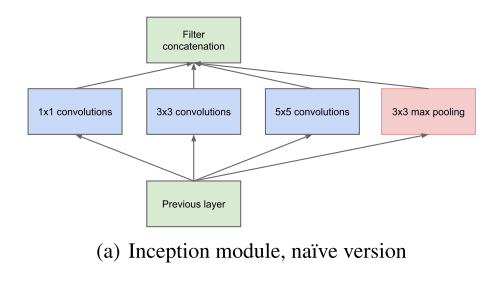
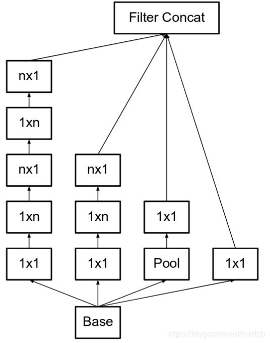
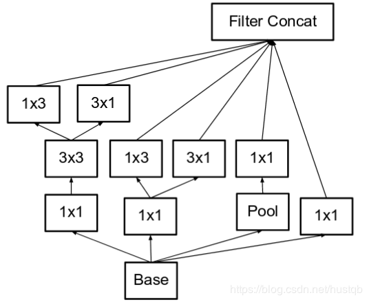

#### 一、Inception Network

##### （一）、Inception V1
###### 1、针对的问题：
目前图像领域的深度学习，使用更深的网络提升representation power，从而提高准确率，但是这会导致网络需要更新的参数爆炸式增长，导致两个严重的问题：
（1）模型size越大，则参数越多。在训练数据量有限的情况下，更容易过拟合。
（2）模型size越大，所需要的计算资源急剧增加，而且，在网络中，大多数权重参数趋向于零，对于这些“近零”的计算，实际上是一种计算浪费。

为了解决以上问题，把全连接的网络变为稀疏连接（卷积层其实就是一个稀疏连接），当某个数据集的分布可以用一个稀疏网络表达的时候就可以通过分析某些激活值的相关性，将相关度高的神经元聚合，来获得一个稀疏的表示。

**理论依据（Arora）(Provable Bounds for Learning Some Deep Representations)**：一个概率分布可以用一个大的稀疏的深度神经网络表示，最优的结构的构建通过分析上层的激活状态的统计相关性，并把输出高度相关的神经元聚合。这与生物学中Hebbian法则“有些神经元响应基本一致，即同时兴奋或抑制”一致。

**存在问题**：

 1. 目前，计算设备在非均匀稀疏数据结构的数值计算非常低效。即使稀疏网络结构需要的计算量被减少100倍，查找和缓存失败的开销也会使理论上运算量减少带来的优势不复存在
 2. 此外，非均匀稀疏模型（网络结构的稀疏形式不统一）需要更复杂的设计和计算设备。当前大多数基于视觉的机器学习系统是利用卷积的特点在空间域实现稀疏的，但是卷积仅是在浅层作为对patches稠密连接（dense connection）的集合。早些的时候，为了打破网络对称性和提高学习能力，传统的网络都使用了稀疏连接。可是，后来为了更好地优化并行运算在AlexNet中又重新启用了全连接

**目标**：设计一种既能利用稀疏性，又可以利用稠密计算的网络结构。

**借鉴的方法**：[Network In Network](https://arxiv.org/abs/1312.4400) 中提出的Network-in-Network方法来增强网络的表示能力（ representation power），在应用时，NIN方法可以被视为1层 `!$1\times 1$` 卷积层+rectified linear activation。

**Inception architecture的核心思想是找到如何通过简单易得的稠密组件（dense components指的是卷积层、池化层等卷积网络的组件）逼近和覆盖卷积网络中理想的局部稀疏结构的方法。**

###### 2、Inception module,naïve version

为了使网络既能学习全局性特征，又能学习局部性特征，做了如下改进：

1. 使用 `!$3$` 个不同的卷积核 `!$1\times 1$`,`!$3\times 3$`,`!$5\times 5$`(论文中说也可以加上 `!$7\times 7$`,...但实验发现性价比不高)。
2. 在宽度上增加 `!$3\times 3$` 最大池化 是为了增强图像的抗噪能力。
3. 以上 `!$4$` 个模块的结果会在通道(channel)轴做拼接。



`!$1\times 1$` 大小卷积最主要的作用是dimension reduction，否则会限制网络的大小，`!$1\times 1$` 卷积核的应用允许从depth和width上增大网络，而不会带来大量计算的负担。 

在Inception中 `!$1\times 1$` 考虑到local region，`!$3\times 3$` 和 `!$5\times 5$` 则考虑到spatially spread out clusters(空间上较分散的特征)。所以在lower的层中主要是local信息，所以 `!$1\times 1$` 的output number要多一些，但在higher的层中往往捕捉的是features of higher abstraction，所以在higher layer中 `!$3\times 3$` 和 `!$5\times 5$` 的比例应该增大。

在这种 naïve Inception 中有一个跟严重的问题是：经过 Inception 结构以后的卷积 output number 增加太多，这样就导致只经过几个 stage 就会出现 computation blow up 问题。因为 pooling 只能改变 mapping 的大小，而不改变 output number，所以当使用 naïve Inception 时需要 concatenate 三个卷积的输出以及pooling的输出，所以当上一层的channel较大时，输出的 output number 会更大。并且 `!$5\times5$` 的卷积即使在output number适中时，当channel极大时，计算量也是巨大的。上述问题引出了带有dimension reduction的Inception结构：这种方法的思想来源于即使一个低维度的embedding也能包含一个相对大的image patch的很多信息，但embedding压缩过于稠密。但利用naïve Inception这种结构的稀疏性，在耗费计算量的 `!$3\times 3$` 和 `!$5\times 5$` 卷积之前使用 `!$1\times 1$` 卷积降维，减少卷积输入的channel，注意是通道的降维，不是空间的降维，例如原本是 `!$M$` 通道，降维到 `!$P$` 通道后，在通过汇聚变成了 `!$M$` 通道，这时参数的个数并没有随着深度的加深而指数级的增长。（比如 previous layer 为 `!$56\times 56\times 64$`，不加 `!$1\times 1$` 卷积核而直接加 `!$128$` 个 `!$5\times 5$` 卷积核时，参数量为 `!$5\times 5\times 64\times 128$`；而先加入 `!$32$` 个 `!$1\times 1$` 卷积核再连接 `!$128$` 个 `!$5\times 5$` 卷积核时，参数量为 `!$1\times 1\times 1\times 64\times 32 + 5\times 5\times 32\times 128$`）。**同时在使用reduction后同时使用ReLU，这样一方面减少了输入channel的数量，另一方面增强非线性。**

###### 3、Inception V1

为了减少参数数目，降低计算量，做了如下改进：

1. `!$3\times 3$` 和 `!$5\times 5$` 之前加入了 `!$1\times 1$` 用于压缩并学习通道特征
2. `!$3\times 3$` 最大池化 后加入 `!$1\times 1$` 也是为了压缩并学习通道特征


**Filter concatenation：** filter banks的简单合并，filter banks应该就是这些filters的计算结果（属于中间结果），concat后形成feature map。要说明的是卷积得到的feature map的尺寸主要取决于stride，kernel size不一样时，只需要进行 padding 补齐就可以。只要 stride 一样，最后得到的 feature map 的大小也是一样的；

论文中提到，Inception模块适合加在网络的高层，越往上层，Inception模块中的 `!$3\times 3$` 以及 `!$5\times 5$` 卷积核数量应该增加。这一点我目前认为是网络层数越高，网络输出的相关性变化，更高层捕捉到的抽象特征相对于原始输入的图像来说分布应该是越分散的，所以filter的尺寸应该相应地变大，也就是更大尺寸的filter的比例应该增加。

**疑问：为什么 `!$1\times 1$` 在池化操作的后面？（可能由于 `!$3\times 3$` 最大池化是无参操作，所以 `!$1\times 1$` 放在后面也不会增加计算量）。**

##### （二）、GoogLeNet

运用Inception单元构造成 GoogLeNet(通常说Inception网络应该就是指 GoogLeNet，GoogLeNet 是ImageNet2014 比赛的第一名，包括task1分类任务和task2检测任务。)：

1.  网络前端部分先用了几层普通的卷积模块过渡。（疑问：不明白为什么要过渡？）
2.  网络主体部分是 `!$9$` 个Inception V1单元。
3.  网络最后端是分类器单元(包括池化层和分类层)。
4.  网络附加部分又有两个分类器单元。原因有二：一是网络太深了，误差反向传递的时候对网络前端影响有限，加入的两个分类器可以防止梯度消失。二是实验表明网络中间层特征已经足够用来进行分类了，即中间分类器的分类结果可信，中间损失对参数更新有一定的指导性。

##### （三）、Inception-BN

##### （四）、分解卷积核——Inception V2（官方的版本）

###### 1. 用两个 `!$3\times 3$` 卷积替代 `!$5\times 5$` 

* 减少了参数的数目，可以降低计算量。
* 两个堆叠 `!$3\times 3$` 获得的感受野(receptive field) 与 `!$5\times 5$` 是相同的。


###### 2、用 `!$n\times 1$` 和 `!$1\times n$` 堆叠替代 `!$n\times n$`



###### 3、用 `!$n\times 1$` 和 `!$1\times n$` 并联替代 `!$n\times n$`



###### 4、实验用的网络整体结构


* 上表中figure5、6、7分别对应上述的 3 种卷积核的因子分解方式1、2、3。
* 上表中红框所示部分是网络的前端部分，对应第一个版本GoogLeNet的前半部分。

相对于GoogLeNet的改进：把 `!$7\times 7$` 卷积替换为 `!$3$` 个 `!$3\times 3$` 卷积。包含 `!$3$` 个Inception部分。第一部分是 `!$35\times 35\times 288$`，使用了 `!$2$` 个 `!$3\times 3$` 卷积代替了传统的 `!$5\times 5$`；第二部分减小了feature map，增多了filters，为 `!$17\times 17\times 768$`，使用了 `!$n\times 1->1\times n$` 结构；第三部分增多了filter，使用了卷积池化并行结构。网络有42层，但是计算量只有GoogLeNet的 `!$2.5$` 倍。

##### （五）、Inception V3
从提高网络分类准确率的角度重新优化了Inception v2。
**需要说明的是：从作者做实验的角度来说，Inception V1《=》GoogleNet，Inception V2 《=》上图中的网络整体结构**，下面是得到Inception V3的过程：

1. Inception V2中的优化器从moment SGD换成了RMSProp得到Inception V2 RMSProp;
2. Inception V2 RMSProp在最后计算损失阶段使用了标签平滑正则化(Label Smoothing Regularization)得到Inception V2 Label Smoothing;
3. Inception V2 Label Smoothing进一步改变了Inception的结构得到Inception V Factorized 7x7;
4. Inception V Factorized 7x7 去掉了一个附加分类器，并在另一个附加分类器中加入了BatchNorm得到Inception V2 BN-auxiliary（**这就是Inception V3**）

###### 1、类别标签平滑正则化

IncentionV3 提出一种通过估计 label-dropout 的边缘化效应(marginalized effect)来正则化分类器层的机制，即Label-smoothing Regularization，LSR。

**参数汇总：**
 `!$z_i$` - logits，未被归一化的对数概率。

 `!$p$` - predicted probability，样本的预测概率。

 `!$q$` - groundtruth probability，样本的真实类别标签概率。 one-shot 时，样本的真实概率为 Dirac 函数，即 `!$q(k) = \delta _{k, y}$`，`!$y$` 为真实的类别标签。
 
对于每个训练样本 `!$x$`，网络模型计算其关于每个类别标签 `!$k\in \{1\ldots K \}$`  的概率值，Softmax 层输出的预测概率：
```mathjax!
$$
p(k|x) = \frac{exp(z_k)}{\sum _{i=1}^K exp(z_i)}
$$
```
其中,`!$z_i$`  是 logits 或者未归一化的 log-概率值(log-probability)。

假设对该样本关于类别标签  `!$q(k|x)$` 的 ground truth 分布，进行归一化，有：
```mathjax!
$$
\sum _k q(k|x) = 1
$$
```
简单起见，忽略关于样本 `!$x$`  的 `!$p$`  和 `!$q$`  之间的依赖性。

定义样本的损失函数为交叉熵(cross entropy)：
```mathjax!
$$
\mathcal{l} = - \sum _{k=1}^K log(p(k)) q(k)
$$
```
最小化该交叉熵损失函数，等价于最大化特定类别标签的期望 log 似然值，该特定类别标签是根据其 ground truth 分布 `!$q(k)$`  选定的。

交叉熵损失函数是关于 logits `!$z_k$`  可微的，因此可以用于深度模型的梯度训练。其梯度的相对简洁形式为：
```mathjax!
$$
\frac{\partial l}{\partial z_k} = p(k) - q(k) \ \ \text{,其值区间为}[-1,1]
$$
```
假设只有单个 ground truth 类别标签 `!$y$`  的情况，则 `!$q(y)=1,q(k)=0(k\neq y)$`，此时，最小化交叉熵损失函数等价于最大化正确类别标签(correct label) 的 log-likelihood。

对于某个样本 `!$x$`，其类别标签为 `!$y$`，对 `!$q(k)$`  计算最大化 log-likelihood，`!$q(k) = \delta _{k,y}$`，`!$\delta_{k,y}$` 其中  为 Dirac 函数，即 `!$k = y$` 时，`!$\delta_{k,y} = 1$`；`!$k\neq y$` 时，`!$\delta_{k,y} = 0$`.

在采用预测的概率来拟合真实的概率时，只有当对应于 ground truth 类别标签的 logit 值远远大于其它类别标签的 logit 值时才可行。但其面临两个问题：

 - 可能导致过拟合 - 如果模型学习的结果是，对于每个训练样本都将全部概率值都分配给 ground truth 类别标签，则不能保证其泛化能力。
 - 其鼓励最大 logit 值和其它 logits 值间的差异尽可能的大，但结合梯度 `!$\frac{\partial l}{\partial z_k}$`  的有界性，其削弱了模型的适应能力。

也就是说，只有模型对预测结果足够有信心时才可能发生的情况。

InceptionV3 提出了一种机制，鼓励模型少一点自信(encouraging the model to be less confident)。

虽然，对于目标是最大化训练标签的 log-likelihoodd 的问题不是所期望的；但却能够正则化模型，并提升模型的适应能力。

假设有类别标签的分布 `!$u(k)$`，其独立于训练样本 `!$x$`，和一个平滑参数 `!$\epsilon$`，对于 ground truth 类别标签为 `!$y$` 的训练样本，将其类别标签的分布 `!$q(k|x) = \delta _{k, y}$`  替换为：
```mathjax!
$$
q^{'} (k|x) = (1 - \epsilon ) \delta _{k, y} + \epsilon u(k)
$$
```
是原始 ground truth 分布 `!$q(k|x)$` 、固定分布 `!$u(k)$` 、权重 `!$1 - \epsilon$` 和权重 `!$\epsilon$`  的组合。

可以将类别标签 `!$k$`  的分布的计算可以看作为：

 - 首先，将类别标签设为 groundtruth 类别标签，`!$k = y$`；
 - 然后，采用概率 `!$\epsilon$`  ，将从分布 `!$u(k)$`  中的采样值来取代 `!$k$`；

InceptionV3 中采用类别标签的先验分布来作为 `!$u(k)$`。 如均匀分布(uniform distribution)，`!$u(k) = \frac{1}{K}$`，则：
```mathjax!
$$
q^{'} (k|x) = (1 - \epsilon ) \delta _{k, y} + \epsilon \frac{1}{K}
$$
```
对此，称为类别标签平滑正则化(label-smoothing regularization, LSR)。

LSR 交叉熵变为：
```mathjax!
$$
H(q^{'}, p) = - \sum _{k=1} ^K log(p(k) q^{'}(k)) = (1 - \epsilon) H(q, p) + \epsilon H(u, p)
$$
```
等价于将单个交叉熵损失函数 `!$H(q,p)$`  替换为一对损失函数 `!$H(q,p)$`  和 `!$H(u,p)$`。

损失函数 `!$H(u,p)$`  惩罚了预测的类别标签分布 `!$p$` 相对于先验分布 `!$u$` 的偏差，根据相对权重 `!$\epsilon / 1 - \epsilon$`。 该偏差也可以从 KL divergence 的角度计算，因为 `!$H(u, p) = D_{KL}(u || p) + H(u)$`， `!$H(u)$` 时固定。当  `!$u$` 时均匀分布时，`!$H(u,p)$` 是评价预测的概率分布 `!$p$`  与均匀分布 `!$u$` 间的偏离程度。

**KL divergence ：** 相对熵（relative entropy），又被称为Kullback-Leibler散度（Kullback-Leibler divergence）或信息散度（information divergence），是两个概率分布（probability distribution）间差异的非对称性度量。

##### （六）、Inception V4


#### 二、ResNet
##### 1、针对的问题

随着网络的加深，因为存在梯度消失和梯度爆炸问题，容易出现训练集准确率下降的现象，并且不是过拟合造成的(过拟合的情况训练集应该准确率很高)。

通过在一个浅层网络基础上叠加 `!$y=x$` 的层（称identity mappings，恒等映射），可以让网络随深度增加而不退化。这反映了多层非线性网络无法逼近恒等映射网络。

##### 2、残差学习

Resnet学习的是残差函数 `!$F(x) = H(x) - x$`, 这里如果 `!$F(x) = 0$`，那么就是上面提到的恒等映射。事实上，Resnet是“shortcut connections”的connections在恒等映射下的特殊情况，它没有引入额外的参数和计算复杂度。 假如优化目标函数是逼近一个恒等映射, 而不是 `!$0$` 映射，那么学习找到对恒等映射的扰动 `!$(F(x))$` 会比重新学习一个映射函数要容易。

##### 3、残差块


ResNet提出了两种mapping：

1. 一种是identity mapping，指的就是图中”弯弯的曲线”，这种连接方式叫做“shortcut connection”。
2. 一种residual mapping，指的就是除了”弯弯的曲线“那部分，所以最后的输出是 `!$y = F(x) + x$` 。

identity mapping，就是指本身，也就是公式中的 `!$x$`，而residual mapping指的是“差”，也就是 `!$y − x$`，所以残差指的就是 `!$F(x)$` 部分。

图中的残差结构有二层，如下表达式，其中 `!$\sigma $` 代表非线性函数ReLU：
```mathjax!
$$
F = W_2 \sigma(W_1 x)
$$
```
然后通过一个shortcut，和第 2 个ReLU，获得输出 `!$y$`
```mathjax!
$$
y = F(x,\{W_i\}) + x \ \ .
$$
```
当需要对输入和输出维数进行变化时（如改变通道数目），可以在shortcut时对 `!$x$` 做一个线性变换 `!$W_s$`，如下式：
```mathjax!
$$
y = F(x,\{W_i\}) + W_s x \ \ .
$$
```
或者，用 `!$0$` 补齐。（作者对两种方式都做了实验）

然而实验证明 `!$x$` 已经足够了，不需要再进行维度变换，除非需求是某个特定维度的输出，如论文中34 层的 Resnet 网络结构图中的虚线，是将通道数翻倍。

##### 4、改进

实际中，考虑计算的成本，对残差块做了计算优化，即将两个 `!$3\times 3$` 的卷积层替换为 `!$1\times 1 + 3\times 3 + 1\times 1$`，如下图。新结构中的中间 `!$3\times 3$` 的卷积层首先在一个降维 `!$1\times 1$` 卷积层下减少了计算，然后在另一个 `!$1\times 1$` 的卷积层下做了还原，既保持了精度又减少了计算量。


这两种结构分别针对ResNet34（左图）和ResNet50/101/152（右图），一般称整个结构为一个”building block“。其中右图又称为”bottleneck design”，目的就是为了降低参数的数目，第一个 `!$1\times 1$` 的卷积把 `!$256$` 维channel降到 `!$64$` 维，然后在最后通过 `!$1\times 1$` 卷积恢复，整体上用的参数数目：`!$1\times 1\times 256\times 64 + 3\times 3\times 64\times 64 + 1\times 1\times 64\times 256 = 69632$`，而不使用bottleneck的话就是两个 `!$3\times 3\times 256$` 的卷积，参数数目: `!$3\times 3\times 256\times 256\times 2 = 1179648$`，差了 `!$16.94$` 倍。

论文作者的观点：对于常规ResNet，可以用于34层或者更少的网络中，对于Bottleneck Design的ResNet通常用于更深的如 101 这样的网络中，目的是减少计算和参数量。


#### 三、DenseNet
DenseNet脱离了加深网络层数(ResNet)和加宽网络结构(Inception)来提升网络性能的定式思维，从特征的角度考虑，通过特征重用和旁路(Bypass)设置，既大幅度减少了网络的参数量，又在一定程度上缓解了gradient vanishing问题的产生。

##### 1、Dense connectivity

假设输入为一个图片 `!$X_0$`，经过一个 `!$L$` 层的神经网络， 其中第 `!$i$` 层的非线性变换记为 `!$H_i(.)$` 。`!$H_i(.)$` 可以是多种函数操作的累加，如 BN、ReLU、Pooling或Conv等。第 `!$i$` 层的特征输出记作 `!$X_i$`。

**ResNet：** 
传统卷积前馈神经网络将第 `!$l$` 层的输出 `!$x_l $`
作为 `!$l + 1$` 层的输入,可以写作 `!$x_l = H_l(x_{l - 1})$`。
ResNet增加了旁路连接,可以写作 `!$x_l = H_l(x_{x - 1}) + x_{x - 1}$`
ResNet的一个最主要的优势便是梯度可以流经恒等函数来到达靠前的层。但恒等映射和非线性变换输出的叠加方式是相加, 这在一定程度上破坏了网络中的信息流。

**DenseNet：**
为了进一步优化信息流的传播，DenseNet提出了图示的网络结构：


第 `!$l$` 层的输入不仅与 `!$l - 1$` 层的输出相关，还有所有之前层的输出有关。记作：
```mathjax!
$$
x_l = H_l([x_0,x_1,\ldots ,x_{l - 1}])
$$
```

其中 `!$[]$` 代表 concatenation(拼接)，既将 `!$X_0$` 到 `!$X_{l - 1}$` 层的所有输出feature map按Channel组合在一起。这里所用到的非线性变换 Hl 为BN+ReLU+ Conv(3×3)的组合。

##### 2、Composite function
非线性变换 `!$H_l$` 为 `!$BN+ReLU+ Conv(3×3)$` 的组合。


##### 3、过渡层（Transition Layer）
过渡层包含瓶颈层（bottleneck layer，即 `!$1\times 1$` 卷积层）和池化层。

###### 1)、Pooling layers
由于在DenseNet中需要对不同层的 feature map 进行 cat 操作，所以需要不同层的feature map保持相同的feature size，这就限制了网络中 Down sampling 的实现。为了使用 Down sampling，作者将 DenseNet 分为多个Dense block，如下图所示：


在同一个 Dense block 中要求 feature size 保持相同大小，在不同Dense block之间设置 transition layers 实现 Down sampling, 在作者的实验中 transition layer 由 `!$BN + Conv(1\times 1) ＋(2\times 2) average-pooling$` 组成。

###### 2)、Bottleneck layers
虽然DenseNet接受较少的k（feature map的数量）作为输出，但由于不同层 feature map 之间由 cat 操作组合在一起，最终仍然会是feature map的channel较大而成为网络的负担。作者在这里使用 `!$1×1$` Conv(Bottleneck) 作为特征降维的方法来降低channel数量，以提高计算效率。经过改善后的非线性变换变为 `!$BN-ReLU-Conv(1×1)-BN-ReLU-Conv(3×3)$`。在实验中使用 Bottleneck layers 的 DenseNet 被称为DenseNet-B。

##### 4、Growth rate
在Dense block中,假设每一个非线性变换 `!$H$` 的输出为 `!$K$` 个feature map, 那么第 `!$i$` 层网络的输入便为 `!$K_0 + (i-1)\times K$`, `!$K_0$` 为输入层的通道数，这里我们可以看到DenseNet 和现有网络的一个主要的不同点：DenseNet 可以接受较少的特征图数量作为网络层的输出。


原因就是在同一个Dense block中的每一层都与之前所有层相关联，如果我们把 feature 看作是一个Denseblock的全局状态，那么每一层的训练目标便是通过现有的全局状态，判断需要添加给全局状态的更新值。因而每个网络层输出的特征图数量 `!$K$` 又称为Growth rate，同样决定着每一层需要给全局状态更新的信息的多少。在作者的实验中只需要较小的 `!$K$` 便足以实现 state-of-art 的性能。

##### 5、Compression
为了进一步优化模型，可以在 transition layer 中降低 feature map 的数量。若一个 Dense block 中包含 `!$m$` 个 feature maps，使其输出连接的 transition layer 层生成 ⌊θm⌋ 个输出feature map。其中 `!$\theta $` 为Compression factor，当 `!$\theta=1$` 时，transition layer 将保留原 feature 维度不变。在实验中使用compression且 `!$\theta =0.5$` 的 DenseNet 命名为 DenseNet-C，将使用Bottleneck和compression且 `!$\theta=0.5$` 的DenseNet命名为 DenseNet-BC。

#### 6、特点
DenseNet作为拥有较深层数的卷积神经网络，具有如下优点：

1. 相比 ResNet 拥有更少的参数数量。
2. 旁路加强了特征的重用。
3. 网络更易于训练，并具有一定的正则效果。
4. 缓解了 gradient vanishing 和 model degradation 的问题。
