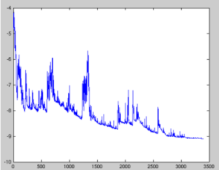
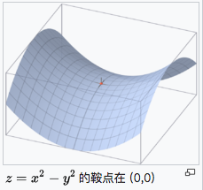
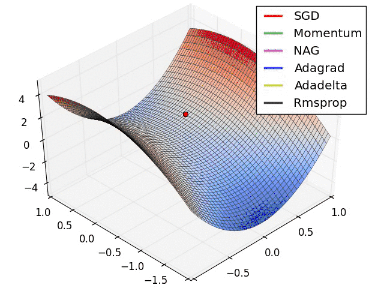

**论文：An overview of gradient descent optimization algorithms**

##### 一、最常见的优化器算法

梯度下降最常见的三种变形 BGD，SGD，MBGD，这三种形式的区别就是取决于我们用多少数据来计算目标函数的梯度，这样的话自然就涉及到一个 trade－off，即参数更新的准确率和运行时间。

###### 1、Batch Gradient Descent （BGD）
**梯度更新规则:**
BGD 采用整个训练集的数据来计算 cost function 对参数的梯度：
```mathjax!
$$
\theta = \theta - \eta \cdot \nabla_{\theta}J(\theta)
$$
```

**缺点：**

 - 由于这种方法是在一次更新中，就对整个数据集计算梯度，所以计算起来非常慢，遇到很大量的数据集也会非常棘手，而且不能投入新数据实时更新模型。

``` python
for i in range(nb_epochs):
  params_grad = evaluate_gradient(loss_function, data, params)
  params = params - learning_rate * params_grad
  
# 我们会事先定义一个迭代次数 epoch，首先计算梯度向量 params_grad，然后沿着梯度的方向更新参数 params，learning rate 决定了我们每一步迈多大。
```

<p style="font-size:120%;color:red">Batch gradient descent 对于凸函数可以收敛到全局极小值，对于非凸函数可以收敛到局部极小值。</p>

###### 2、Stochastic Gradient Descent (SGD)
**梯度更新规则:**
和 BGD 的一次用所有数据计算梯度相比，SGD 每次更新时对每个样本进行梯度更新，对于很大的数据集来说，可能会有相似的样本，这样 BGD 在计算梯度时会出现冗余，而 <span style="color:red">SGD 一次只进行一次更新，就没有冗余，而且比较快，并且可以新增样本。</span>
```mathjax!
$$
\theta = \theta - \eta \cdot \nabla_{\theta}J(\theta;x^{(i)};y^{(i)})
$$
```

``` python
for i in range(nb_epochs):
  np.random.shuffle(data)
  for example in data:
    params_grad = evaluate_gradient(loss_function, example, params)
    params = params - learning_rate * params_grad
```

 看代码，可以看到区别，就是整体数据集是个循环，其中对每个样本进行一次参数更新。
 

 
 随机梯度下降是通过每个样本来迭代更新一次，如果样本量很大的情况，那么可能只用其中部分的样本，就已经将theta迭代到最优解了，对比上面的批量梯度下降，迭代一次需要用到十几万训练样本，一次迭代不可能最优，如果迭代10次的话就需要遍历训练样本10次。<span style="color:red">缺点是SGD的噪音较BGD要多，使得SGD并不是每次迭代都向着整体最优化方向。所以虽然训练速度快，但是准确度下降，并不是全局最优。虽然包含一定的随机性，但是从期望上来看，它是等于正确的导数的。</span>

**缺点：**

 - SGD 因为更新比较频繁，会造成 cost function 有严重的震荡。
 
BGD 可以收敛到局部极小值，当然 SGD的震荡可能会跳到更好的局部极小值处。 当我们稍微减小 learning rate，SGD 和 BGD 的收敛性是一样的。

###### 3、Mini-Batch Gradient Descent （MBGD）
**梯度更新规则：**
MBGD 每一次利用一小批样本，即 n 个样本进行计算，这样它可以降低参数更新时的方差，收敛更稳定，另一方面可以充分地利用深度学习库中高度优化的矩阵操作来进行更有效的梯度计算。
```mathjax!
$$
\theta = \theta - \eta \cdot \nabla_{\theta}J(\theta;x^{(i:i+n)};y^{(i:i+n)})
$$
```
和 SGD 的区别是每一次循环不是作用于每个样本，而是具有 n 个样本的批次。

``` python
for i in range(nb_epochs):
  np.random.shuffle(data)
  for batch in get_batches(data, batch_size=50):
    params_grad = evaluate_gradient(loss_function, batch, params)
    params = params - learning_rate * params_grad
```

<span style="color:red">超参数设定值:  n 一般取值在 50～256</span>

**缺点：（两大缺点）**

 - 不过 Mini-batch gradient descent 不能保证很好的收敛性，learning rate 如果选择的太小，收敛速度会很慢，如果太大，loss function 就会在极小值处不停地震荡甚至偏离。（有一种措施是先设定大一点的学习率，当两次迭代之间的变化低于某个阈值后，就减小 learning rate，不过这个阈值的设定需要提前写好，这样的话就不能够适应数据集的特点。）对于非凸函数，还要避免陷于局部极小值处，或者鞍点处，因为鞍点周围的error是一样的，所有维度的梯度都接近于0，SGD 很容易被困在这里。（会在鞍点或者局部最小点震荡跳动，因为在此点处，如果是训练集全集带入即BGD，则优化会停止不动，如果是mini-batch或者SGD，每次找到的梯度都是不同的，就会发生震荡，来回跳动。）
 
 - SGD对所有参数更新时应用同样的 learning rate，如果我们的数据是稀疏的，我们更希望对出现频率低的特征进行大一点的更新。LR会随着更新的次数逐渐变小。
 
鞍点就是：一个光滑函数的鞍点邻域的曲线，曲面，或超曲面，都位于这点的切线的不同边。例如这个二维图形，像个马鞍：在x-轴方向往上曲，在y-轴方向往下曲，鞍点就是（0，0）。



<p style="font-size:160%;color:blue">为了应对上面的两点挑战就有了下面这些算法：</p>

##### 二、［应对挑战 1］
###### 1、Momentum

SGD 在 ravines 的情况下容易被困住， ravines 就是曲面的一个方向比另一个方向更陡，这时 SGD 会发生震荡而迟迟不能接近极小值：


**梯度更新规则:**
 Momentum 通过加入 `!$\gamma v_{t−1}$` ，可以加速 SGD， 并且抑制震荡:
 ```mathjax!
 $$
 v_t = \gamma v_{t−1} + \eta \nabla_{\theta}J(\theta)  \ \ \  \theta = \theta - v_t
 $$
 ```
 
 当我们将一个小球从山上滚下来时，没有阻力的话，它的动量会越来越大，但是如果遇到了阻力，速度就会变小。加入的这一项，**可以使得梯度方向不变的维度上速度变快，梯度方向有所改变的维度上的更新速度变慢，这样就可以加快收敛并减小震荡。**

<span style="color:red">超参数设定值:  一般 γ 取值 0.9 左右。</span>

**缺点：**
这种情况相当于小球从山上滚下来时是在盲目地沿着坡滚，如果它能具备一些先知，例如快要上坡时，就知道需要减速了的话，适应性会更好。

###### 2、Nesterov Accelerated Gradient

**梯度更新规则:**
用 `!$\theta −\gamma v_{t−1}$` 来近似当做参数下一步会变成的值，则在计算梯度时，不是在当前位置，而是未来的位置上:
```mathjax!
$$
 v_t = \gamma v_{t−1} + \eta \nabla_{\theta}J(\theta -\gamma v_{t-1})  \ \ \  \theta = \theta - v_t
$$
```

<span style="color:red"> 超参数设定值:  一般 γ 仍取值 0.9 左右。</span>

**效果比较：**


蓝色是 Momentum 的过程，会先计算当前的梯度，然后在更新后的累积梯度后会有一个大的跳跃。
而 NAG 会先在前一步的累积梯度上(brown vector)有一个大的跳跃，然后衡量一下梯度做一下修正(red vector)，这种预期的更新可以避免我们走的太快。

NAG 可以使 RNN 在很多任务上有更好的表现。

目前为止，我们可以做到，**在更新梯度时顺应 loss function 的梯度来调整速度，并且对 SGD 进行加速。**

**我们还希望可以根据参数的重要性而对不同的参数进行不同程度的更新。**

##### 三、［应对挑战 2］

###### 1、Adagrad （Adaptive gradient algorithm）
这个算法就<span style="color:red"> 可以对低频的参数做较大的更新，对高频的做较小的更新，也因此，对于稀疏的数据它的表现很好，很好地提高了 SGD 的鲁棒性，</span> 例如识别 Youtube 视频里面的猫，训练 GloVe word embeddings，因为它们都是需要在低频的特征上有更大的更新。

 **梯度更新规则:**
```mathjax!
$$
\theta_{t+1,i} = \theta_{t,i} - \frac{\eta}{\sqrt{G_{t,ii} + \epsilon}} \cdot g_{t,i}
$$
```
其中 `!$g$` 为：`!$t$` 时刻参数 `!$θ_i$` 的梯度:
```mathjax!
$$
g_{t,i} = \nabla_{\theta}J(\theta_i)
$$
```
如果是普通的 SGD， 那么 `!$θ_i$` 在每一时刻的梯度更新公式为：
```mathjax!
$$
\theta_{t+1,i} = \theta_{t,i} - \eta \cdot g_{t,i}
$$
```
但这里的 learning rate `!$\eta $` 也随 `!$t$` 和 `!$i$` 而变：
```mathjax!
$$
\theta_{t+1,i} = \theta_{t,i} - \frac{\eta}{\sqrt{G_{t,ii} + \epsilon}} \cdot g_{t,i}
$$
```
其中 `!$G_t$` 是个对角矩阵，`!$ (i,i)$` 元素就是 `!$t$` 时刻参数 `!$\theta_i$` 的梯度平方和。

Adagrad 的优点是减少了学习率的手动调节

<span style="color:red"> 超参数设定值：一般 `!$\theta$` 选取 0.01</span> 

**缺点：**
它的缺点是分母会不断积累，这样学习率就会收缩并最终会变得非常小。

###### 2、Adadelta
这个算法是对 Adagrad 的改进，和 Adagrad 相比，就是分母的 G 换成了过去的梯度平方的衰减平均值，指数衰减平均值:
```mathjax!
$$
\Delta \theta_t = - \frac{\eta}{\sqrt{E[g^2]_t + \epsilon}} \cdot g_{t}
$$
```
这个分母相当于**梯度的均方根 root mean squared (RMS)**，在数据统计分析中，将所有值平方求和，求其均值，再开平方，就得到均方根值 ，所以可以用 RMS 简写：
```mathjax!
$$
\Delta \theta_t = - \frac{\eta}{ RMS[g]_t } \cdot g_{t}
$$
```
其中 `!$E$` 的计算公式如下，`!$t$` 时刻的依赖于前一时刻的平均和当前的梯度：
```mathjax!
$$
E[g^2]_t = \gamma E[g^2]_{t-1} + (1 - \gamma)g_t^2
$$
```

**梯度更新规则:**
此外，还将学习率 `!$\eta $` 换成了 `!$RMS[\Delta \theta]$`，这样的话，我们甚至都不需要提前设定学习率了：
```mathjax!
$$
\Delta \theta_t = - \frac{ RMS[\Delta \theta]_{t - 1} }{ RMS[g]_t } \cdot g_{t} \\
\theta_{t + 1} = \theta_t + \Delta \theta_t
$$
```

<span style="color:red">超参数设定值:  `!$\gamma $` 一般设定为 0.9</span>

###### 3、RMSprop
RMSprop 是 Geoff Hinton 提出的一种自适应学习率方法。

**RMSprop 和 Adadelta 都是为了解决 Adagrad 学习率急剧下降问题的**

**梯度更新规则:**
```mathjax!
$$
E[g^2]_t = 0.9E[g^2]_{t - 1} + 0.1 g_t^2  \\  \theta_{t+1} = \theta_t - \frac{\eta}{\sqrt{E[g^2]_t + \epsilon}} \cdot g_{t}
$$
```

RMSprop 与 Adadelta 的第一种形式相同：**（使用的是指数加权平均，旨在消除梯度下降中的摆动，与Momentum的效果一样，某一维度的导数比较大，则指数加权平均就大，某一维度的导数比较小，则其指数加权平均就小，这样就保证了各维度导数都在一个量级，进而减少了摆动。允许使用一个更大的学习率 `!$\eta $`）**

 <span style="color:red">超参数设定值:  Hinton 建议设定 `!$\gamma $` 为 0.9, 学习率 `!$\eta $` 为 0.001。</span>

###### 4、Adam：Adaptive Moment Estimation

这个算法是另一种计算每个参数的自适应学习率的方法。相当于 RMSprop + Momentum

除了像 Adadelta 和 RMSprop 一样存储了过去梯度的平方 `!$v_t$` 的指数衰减平均值 ，也像 momentum 一样保持了过去梯度 `!$m_t$` 的指数衰减平均值：
```mathjax!
$$
m_t = \beta_1 m_{t - 1} + (1 - \beta_1)g_t  \\  v_t = \beta_2 v_{t - 1} + (1 - \beta_2)g_t^2
$$
```

如果 `!$m_t$` 和 `!$v_t$` 被初始化为 `!$0$` 向量，那它们就会向 `!$0$` 偏置，所以做了偏差校正，通过计算偏差校正后的 `!$m_t$` 和 `!$v_t$` 来抵消这些偏差：
```mathjax!
$$
\hat m_t = \frac{ m_t }{(1 - \beta_1^t)}  \\  \hat v_t = \frac{ v_t }{(1 - \beta_2^t)}
$$
```

**梯度更新规则:**
```mathjax!
$$
\theta_{t+1} = \theta_t - \frac{\eta}{\sqrt{ \hat v_t } + \epsilon} \cdot \hat m_{t}
$$
```

 <span style="color:red">超参数设定值:  建议 `!$\beta_1 ＝ 0.9$`，`!$\beta_2 ＝ 0.999$`，`!$\epsilon ＝ 10e−8$`</span>
 
 **实践表明，Adam 比其他适应性学习方法效果要好。**
 
##### 四、效果比较
下面看一下几种算法在鞍点和等高线上的表现：




上面两种情况都可以看出，Adagrad, Adadelta, RMSprop 几乎很快就找到了正确的方向并前进，收敛速度也相当快，而其它方法要么很慢，要么走了很多弯路才找到。

由图可知自适应学习率方法即 Adagrad, Adadelta, RMSprop, Adam 在这种情景下会更合适而且收敛性更好。

##### 五、如何选择优化算法

 1. 如果数据是稀疏的，就用自适用方法，即 Adagrad, Adadelta, RMSprop, Adam。
 2. RMSprop, Adadelta, Adam 在很多情况下的效果是相似的。
 3. Adam 就是在 RMSprop 的基础上加了 bias-correction 和 momentum，
 4. 随着梯度变的稀疏，Adam 比 RMSprop 效果会好。
 5. 整体来讲，Adam 是最好的选择。
 6. 很多论文里都会用 SGD，没有 momentum 等。SGD 虽然能达到极小值，但是比其它算法用的时间长，而且可能会被困在鞍点。
 7. 如果需要更快的收敛，或者是训练更深更复杂的神经网络，需要用一种自适应的算法。