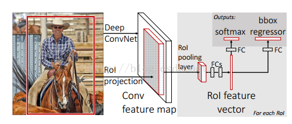

###### 计算机视觉的任务：

#### 一、R-CNN
**论文：Rich feature hierarchies for accurate object detection and semantic segmentation**

##### （一）、解决的问题
（1）、经典的目标检测算法使用滑动窗法依次判断所有可能的区域。本文则预先提取一系列较可能是物体的候选区域，之后仅在这些候选区域上提取特征，进行判断。
（2）、经典的目标检测算法在区域中提取人工设定的特征（Haar，HOG）。本文则需要训练深度网络进行特征提取。可供使用的有两个数据库： 

 - 一个较大的识别库（ImageNet ILSVC 2012）：标定每张图片中物体的类别。一千万图像，1000类。 
 - 一个较小的检测库（PASCAL VOC 2007）：标定每张图片中，物体的类别和位置。一万图像，20类。 

本文使用识别库进行预训练，而后用检测库调优参数。最后在检测库上评测。

##### （二）、算法流程
RCNN算法分为4个步骤 
- 一张图像生成1K~2K个**候选区域（POI）** 
- 对每个候选区域，使用深度网络**提取特征** 
- 特征送入每一类的**SVM 分类器**，判别是否属于该类 
- 使用**回归器**精细修正候选框位置 

###### 1、候选区域生成
使用了Selective Search1方法从一张图像生成约2000-3000个候选区域。基本思路如下： 
- 使用一种过分割手段，将图像分割成小区域 
- 查看现有小区域，合并可能性最高的两个区域。重复直到整张图像合并成一个区域位置 
- 输出所有曾经存在过的区域，所谓候选区域

候选区域生成和后续步骤相对独立，实际可以使用任意算法进行。

###### 合并规则
优先合并以下四种区域： 
- 颜色（颜色直方图）相近的 
- 纹理（梯度直方图）相近的 
- 合并后总面积小的 
- 合并后，总面积在其BBOX中所占比例大的

第三条，保证合并操作的尺度较为均匀，避免一个大区域陆续“吃掉”其他小区域。
例：设有区域a-b-c-d-e-f-g-h。
较好的合并方式是：ab-cd-ef-gh -> abcd-efgh -> abcdefgh。 
不好的合并方法是：ab-c-d-e-f-g-h ->abcd-e-f-g-h ->abcdef-gh -> abcdefgh。

第四条，保证合并后形状规则。
例：左图适于合并，右图不适于合并：

上述四条规则只涉及区域的颜色直方图、纹理直方图、面积和位置。合并后的区域特征可以直接由子区域特征计算而来，速度较快。

###### 多样化与后处理
为尽可能不遗漏候选区域，上述操作在多个颜色空间中同时进行（RGB,HSV,Lab等）。在一个颜色空间中，使用上述四条规则的不同组合进行合并。所有颜色空间与所有规则的全部结果，在去除重复后，都作为候选区域输出。

###### 2、特征提取
###### 预处理
使用深度网络提取特征之前，首先把候选区域归一化成同一尺寸227×227。 

此处有一些细节可做变化：外扩的尺寸大小，形变时是否保持原比例，对框外区域直接截取还是补灰。会轻微影响性能。

###### 预训练
**网络结构** 
基本借鉴Hinton 2012年在ImageNet上的分类网络，略作简化。 

 
 
此网络提取的特征为4096维，之后送入一个4096->1000的全连接(fc)层进行分类。 
学习率0.01。

**训练数据** 
使用ILVCR 2012的全部数据进行训练，输入一张图片，输出1000维的类别标号。

###### 调优训练
**网络结构** 
同样使用上述网络，最后一层换成4096->21的全连接网络。 

学习率0.001，每一个batch包含32个正样本（属于20类）和96个背景。

**训练数据** 
使用PASCAL VOC 2007的训练集，输入一张图片，输出21维的类别标号，表示20类+背景。 
考察一个候选框和当前图像上所有标定框重叠面积最大的一个。如果重叠比例大于0.5，则认为此候选框为此标定的类别；否则认为此候选框为背景。

###### 3、类别判断
**分类器** 
对每一类目标，使用一个线性SVM二类分类器进行判别。输入为深度网络输出的4096维特征，输出是否属于此类。 
由于负样本很多，使用hard negative mining方法。 
**正样本** 
本类的真值标定框。 
**负样本** 
考察每一个候选框，如果和本类所有标定框的重叠都小于 0.3，认定其为负样本。

###### 4、位置精修
目标检测问题的衡量标准是重叠面积：许多看似准确的检测结果，往往因为候选框不够准确，重叠面积很小。故需要一个位置精修步骤。 
**回归器** 
对每一类目标，使用一个线性脊回归器进行精修。正则项 `!$\lambda=10000$`。 
输入为深度网络pool5层的4096维特征，输出为xy方向的缩放和平移。 

**训练样本** 
判定为本类的候选框中，和真值重叠面积大于0.6的候选框。

**BoundingBox Regression（BBR）**
对于预测框 P，我们有一个ground truth是 G：当 0.1< IoU < 0.5 时出现重复，这种情况属于作者说的poor localiazation, 因此使用 iou>0.6 的 Bounding Box 进行BBR,也就是 iou<0.6 的 Bounding Box 会直接被舍弃，不进行BBR。这样做是为了满足线性转换的条件。

###### 5、BoundingBox Regression过程

##### （三）结果
论文发表的2014年，DPM已经进入瓶颈期，即使使用复杂的特征和结构得到的提升也十分有限。本文将深度学习引入检测领域，一举将PASCAL VOC上的检测率从35.1%提升到53.7%。 

#### 二、SPPnet（还没看）
**论文：Spatial Pyramid Pooling in Deep Convolutional Networks for Visual Recognition**

#### 三、Fast R-CNN
**论文：Fast R-CNN          Microsoft Research**

##### （一）、解决的问题
Fast R-CNN方法解决了R-CNN的三个问题：

问题一：测试时速度慢 
RCNN一张图像内候选框之间大量重叠，提取特征操作冗余。 
本文将整张图像归一化后直接送入深度网络。在邻接时，才加入候选框信息，在末尾的少数几层处理每个候选框。

问题二：训练时速度慢 
在训练时，本文先将一张图像送入网络，紧接着送入从这幅图像上提取出的候选区域。这些候选区域的前几层特征不需要再重复计算。

问题三：训练所需空间大 
R-CNN中独立的分类器和回归器需要大量特征作为训练样本。 
本文把类别判断和位置精调统一用深度网络实现，不再需要额外存储。

##### （二）、算法流程
Fast R-CNN框架与R-CNN有两处不同：

 - 最后一个卷积层后加了一个ROI pooling layer；
 - 损失函数使用了multi-task loss（多任务损失）函数，将边框回归直接加到CNN网络中训练。分类Fast
   R-CNN直接用softmax替代R-CNN用的SVM进行分类。

Fast R-CNN是端到端（end-to-end）的。

##### （三）、特征提取网络

##### （四）、分类与位置调整

#### 四、Faster R-CNN

#### 五、Mask R-CNN