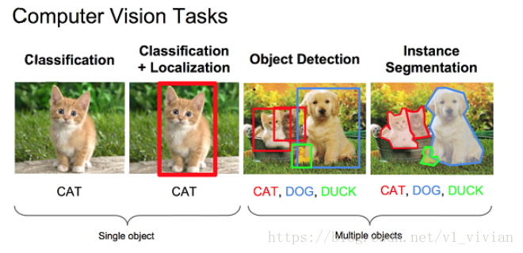
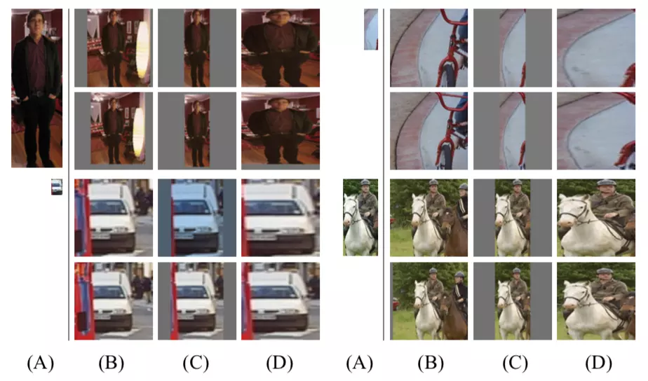
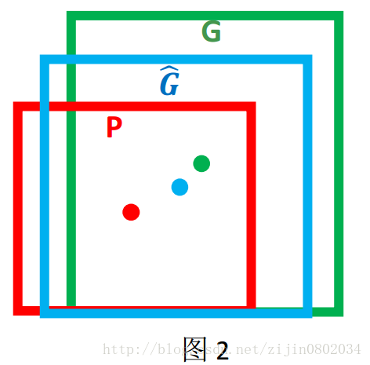
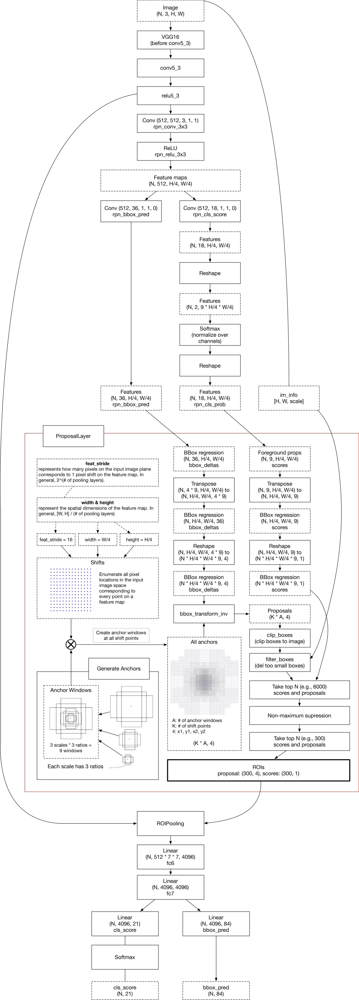

###### 计算机视觉的任务：



# 一、R-CNN
**论文：Rich feature hierarchies for accurate object detection and semantic segmentation**

### （一）、解决的问题
（1）、经典的目标检测算法使用滑动窗法依次判断所有可能的区域。本文则预先提取一系列较可能是物体的候选区域，之后仅在这些候选区域上提取特征，进行判断。
（2）、经典的目标检测算法在区域中提取人工设定的特征（Haar，HOG）。本文则需要训练深度网络进行特征提取。可供使用的有两个数据库： 

 - 一个较大的识别库（ImageNet ILSVC 2012）：标定每张图片中物体的类别。一千万图像，1000类。 
 - 一个较小的检测库（PASCAL VOC 2007）：标定每张图片中，物体的类别和位置。一万图像，20类。 

本文使用识别库进行预训练，而后用检测库调优参数。最后在检测库上评测。

### （二）、算法流程
RCNN算法分为4个步骤 
- 一张图像生成1K~2K个**候选区域（ROI）** 
- 对每个候选区域（Warp后的Region），使用深度网络**提取特征** 
- 将特征送入每一类的**SVM 分类器**，判别是否属于该类 
- 使用**回归器**精细修正候选框位置 


#### 1、候选区域生成
使用了Selective Search方法从一张图像生成约2000-3000个候选区域（Region Proposal）。基本思路如下： 
- 使用一种过分割手段，将图像分割成小区域 
- 查看现有小区域，合并可能性最高的两个区域。重复直到整张图像合并成一个区域位置 
- 输出所有曾经存在过的区域，所谓候选区域

候选区域生成和后续步骤相对独立，实际可以使用任意算法进行。

###### （1）、合并规则
优先合并以下四种区域： 
- 颜色（颜色直方图）相近的 
- 纹理（梯度直方图）相近的 
- 合并后总面积小的 
- 合并后，总面积在其BBOX中所占比例大的

第三条，保证合并操作的尺度较为均匀，避免一个大区域陆续“吃掉”其他小区域。
例：设有区域a-b-c-d-e-f-g-h。
较好的合并方式是：ab-cd-ef-gh -> abcd-efgh -> abcdefgh。 
不好的合并方法是：ab-c-d-e-f-g-h ->abcd-e-f-g-h ->abcdef-gh -> abcdefgh。

第四条，保证合并后形状规则。
例：左图适于合并，右图不适于合并：


上述四条规则只涉及区域的颜色直方图、纹理直方图、面积和位置。合并后的区域特征可以直接由子区域特征计算而来，速度较快。

###### （2）、缩放候选区域
因为CNN对输入图像的大小有限制，所以在将候选区域输入CNN网络之前，要将候选区域进行固定尺寸的缩放。缩放分为两大类（该部分在原文附录A）：



1）各向同性缩放，长宽放缩相同的倍数

 - tightest square with context：把region proposal的边界进行扩展延伸成正方形，灰色部分用原始图片中的相应像素填补，如图(B)所示
 - tightest square without context：把region proposal的边界进行扩展延伸成正方形，灰色部分不填补，如图(C)所示

2）各向异性缩放, 长宽放缩的倍数不同
不管图片是否扭曲，长宽缩放的比例可能不一样，直接将长宽缩放到227x227，如图(D)所示。在放缩之前，作者考虑，在region proposal周围补额外的原始图片像素（pad p）。上图中，第一层p=0，第二层p=16。最后试验发现，采用各向异性缩放并且p=16的时候效果最好。

###### （3）、多样化与后处理
为尽可能不遗漏候选区域，上述操作在多个颜色空间中同时进行（RGB,HSV,Lab等）。在一个颜色空间中，使用上述四条规则的不同组合进行合并。**所有颜色空间与所有规则的全部结果，在去除重复后，都作为候选区域输出。**

<p style="font-size:160%;font-weight:bold;color:red">疑问1： 不知道怎么去除重复？</p>

#### 2、特征提取
###### （1）、预处理
使用深度网络提取特征之前，首先把候选区域（Warp后的Region）归一化成同一尺寸227×227。 

**网络结构** 
基本借鉴Hinton 2012年在ImageNet上的分类网络，略作简化。 

 
 
此网络提取的特征为4096维，之后送入一个4096->1000的全连接(fc)层进行分类。 学习率0.01。

**训练数据** 
使用ILVCR 2012的全部数据进行训练，输入一张图片，输出1000维的类别标号。

###### （2）、调优训练（fine-tuning）
这种方法也是当数据量不够的时候，常用的一种训练方式，即先用别的数据库训练网络，然后再用自己的数据库微调训练(fine-tuning)。微调期间，定义与ground truth的IoU大于0.5的候选区域为正样本，其余的为负样本。这里训练时，网络输出要有所改变，因为分类问题，网络输出为N+1，其中N为正样本的类别数，1为背景。对于VOC，N=20，对于ILSVRC2013检测数据集（不是全部的数据）， N=200。

**网络结构** 
同样使用上述网络，最后一层换成4096->21的全连接网络。 学习率0.001，每一个batch包含32个正样本（属于20类）和96个背景。网络的输入是所有的Warp后的Region，这就是RCNN耗时的原因。

<p style="font-size:160%;font-weight:bold;color:red">疑问2： batch怎么取？正样本和背景怎么判断？</p>

**训练数据** 
使用PASCAL VOC 2007的训练集，输入一张图片，输出21维的类别标号，表示20类+背景。 考察一个候选框和当前图像上所有标定框重叠面积最大的一个。如果重叠比例大于0.5，则认为此候选框为此标定的类别；否则认为此候选框为背景。

#### 3、类别判断
将缩放后的图片输入CNN进行特征提取，对CNN输出的特征用SVM进行打分(每类都有一个SVM，21类就有21个SVM分类器)，**对打好分的区域使用NMS即非极大抑制(每类都单独使用)。**

**分类器** 
对每一类目标，使用一个线性SVM二类分类器进行判别。输入为深度网络输出的4096维特征，输出是否属于此类。 由于负样本很多，使用hard negative mining方法。 

<p style="font-size:120%;font-weight:bold;color:red">hard negative mining方法 ：</p>

**正样本** 
本类的真值标定框。 
**负样本** 
考察每一个候选框，如果和本类所有标定框的重叠都小于 0.3，认定其为负样本。

**1）为什么fine-tuning与SVM正负样本定义不一样？**
在训练SVM时，正样本为groundtruth，负样本定义为与ground truth的IoU小于0.3的候选区域为负样本，介于0.3与0.7之间的样本忽略。fine-tuning时担心过拟合的原因，要扩大正样本的样本量，所以定义比较宽松，但是SVM是最终用于分类的分类器，而且SVM原理就是最小的距离最大化，越难分的数据越有利于SVM的训练，所以对样本的定义比较严格。

**2）为什么不直接用softmax的输出结果？**
因为在训练softmax的时候数据本来就不是很准确，而SVM的训练使用的是hard negative也就是样本比较严格，所以SVM效果会更好。

#### 4、位置精修（回归器）
目标检测问题的衡量标准是重叠面积：许多看似准确的检测结果，往往因为候选框不够准确，重叠面积很小。故需要一个位置精修步骤。 
**回归器** 
对每一类目标，使用一个线性回归器进行精修。正则项 `!$\lambda=10000$`。 输入为深度网络pool5层的4096维特征，输出为xy方向的缩放和平移。 

**训练样本** 
判定为本类的候选框中，和真值重叠面积大于0.6的候选框。

**BoundingBox Regression（BBR）**
对于预测框 P，我们有一个ground truth是 G：当 0.1< IoU < 0.5 时出现重复，这种情况属于作者说的poor localiazation, 因此使用 iou>0.6 的 Bounding Box 进行BBR,也就是 iou<0.6 的 Bounding Box 会直接被舍弃，不进行BBR。这样做是为了满足线性转换的条件。

#### 5、BoundingBox Regression

###### 1、边框回归是什么？
 对于窗口一般使用四维向量 (x,y,w,h) 来表示， 分别表示窗口的中心点坐标和宽高。 对于图 2, 红色的框 P 代表原始的Proposal, 绿色的框 G 代表目标的 Ground Truth， 我们的目标是寻找一种关系使得输入原始的窗口 P 经过映射得到一个跟真实窗口 G 更接近的回归窗口 `!$\hat G$`。



边框回归的目的既是：给定 `!$(P_x,P_y,P_w,P_h)$` 寻找一种映射 `!$f$`， 使得 `!$f(P_x,P_y,P_w,P_h)=(\hat G_x,\hat G_y,\hat G_w,\hat G_h)$`  并且 `!$(\hat G_x,\hat G_y,\hat G_w,\hat G_h)\approx (G_x,G_y,G_w,G_h)$`

###### 2、边框回归怎么做的？
那么经过何种变换才能从图 2 中的窗口 P 变为窗口 `!$\hat G$` 呢？ 比较简单的思路就是: 平移+尺度放缩：

 1. 先做平移 `!$(\Delta x,\Delta y)， \Delta x=P_w d_x(P),\Delta y=P_h d_y(P) $`，这是R-CNN论文的：
```mathjax!
$$
\hat G_x = P_w d_x(P) + P_x \ \ \ \ \ \ \  \text(1)  \\
\hat G_y= P_h d_y(P) + P_y  \ \ \ \ \ \ \  \text(2)
$$
```

 2. 然后再做尺度缩放 `!$(S_w,S_h), S_w=exp(d_w(P)),S_h=exp(d_h(P))$`，对应论文中：
```mathjax!
$$
\hat G_w= P_w exp(d_w(P) ) \ \ \ \ \ \ \  \text(3)  \\
\hat G_h= P_h exp(d_h(P) ) \ \ \ \ \ \ \  \text(4)
$$
```

观察(1)-(4)我们发现， 边框回归学习就是 `!$d_x(P),d_y(P),d_w(P),d_h(P)$` 这四个变换。下一步就是设计算法那得到这四个映射。

线性回归就是给定输入的特征向量 X, 学习一组参数 W, 使得经过线性回归后的值跟真实值 Y(Ground Truth)非常接近. 即 `!$Y\approx WX $`。 那么 Bounding-box 中我们的输入以及输出分别是什么呢？

<p style="font-size:160%;font-weight:bold">Input:</p>

`!$\text{RegionProposal}→P=(P_x,P_y,P_w,P_h)$`，这个是什么？ 输入就是这四个数值吗？其实真正的输入是这个窗口对应的 CNN 特征，也就是 R-CNN 中的 Pool5 feature（特征向量）。 (注：训练阶段输入还包括 Ground Truth， 也就是下边提到的 `!$t_∗=(t_x,t_y,t_w,t_h)$`

<p style="font-size:160%;font-weight:bold">Output:</p>

需要进行的平移变换和尺度缩放 `!$d_x(P),d_y(P),d_w(P),d_h(P)$`， 或者说是 `!$\Delta x,\Delta y,S_w,S_h$` 。 我们的最终输出不应该是 Ground Truth 吗？ 是的， 但是有了这四个变换我们就可以直接得到 Ground Truth， 这里还有个问题， 根据(1)~(4)我们可以知道， P 经过 `!$d_x(P),d_y(P),d_w(P),d_h(P)$` 得到的并不是真实值 G， 而是预测值 `!$\hat G$`。 的确， 这四个值应该是经过 Ground Truth 和 Proposal 计算得到的真正需要的平移量 `!$(tx,ty)$` 和尺度缩放`!$(tw,th)$` 。 这也就是 R-CNN 中的(6)~(9)： 
```mathjax!
$$
t_x = (G_x - P_x) / P_w \ \ \ \ \  (6)  \\
t_y = (G_y - P_y) / P_h \ \ \ \ \ \  (7)  \\
t_w = \log (G_w / P_w) \ \ \ \ \ \ \ \  (8)  \\
t_h = \log(G_h / P_h) \ \ \ \ \ \ \ \ \   (9)
$$
```
那么目标函数可以表示为 `!$d_∗(P)=w^T_∗\Phi_5(P)$`， `!$\Phi_5(P)$` 是输入 Proposal 的特征向量，`!$w_*$` 是要学习的参数（\*表示 x,y,w,h， 也就是每一个变换对应一个目标函数） ,`!$ d_∗(P)$` 是得到的预测值。 我们要让预测值跟真实值 `!$t_∗=(t_x,t_y,t_w,t_h)$` 差距最小， 得到损失函数为：
```mathjax!
$$
Loss = \sum_i^N(t_*^i - \hat w_*^T\phi_5(P^i))^2
$$
```
函数优化目标为：
```mathjax!
$$
W_* = argmin_{w_*} \sum_i^N(t_*^i - \hat w_*^T\phi_5(P^i))^2 + \lambda || \hat w_*||^2
$$
```
利用梯度下降法或者最小二乘法就可以得到 `!$w_∗$`。

###### 3、为什么宽高尺度会设计这种形式？
为什么设计的 `!$t_x,t_y$` 为什么除以宽高，为什么 `!$t_w,t_h$` 会有log形式？

首先CNN具有尺度不变性:


**x,y 坐标除以宽高**
上图的两个人具有不同的尺度，因为他都是人，我们得到的特征相同。假设我们得到的特征为 `!$\Phi_1,\Phi_2$`，那么一个完好的特征应该具备 `!$\Phi_1 = \Phi$`。如果我们直接学习坐标差值，以 x 坐标为例，`!$x_i,p_i$` 分别代表第 i 个框的x坐标，学习到的映射为 `!$f$` , `!$f(\Phi_1)=x_1−p_1$`，同理`!$f(\Phi_2)=x_2−p_2$`。从上图显而易见，`!$x_1−p_1\neq x_2−p_1$`。也就是说同一个 x 对应多个 y，这明显不满足函数的定义。边框回归学习的是回归函数，然而你的目标却不满足函数定义，当然学习不到什么。

**宽高坐标Log形式**
我们想要得到一个放缩的尺度，也就是说这里限制尺度必须大于 0。我们学习的 `!$t_w,t_h$`怎么保证满足大于0呢？直观的想法就是EXP函数，如公式(3), (4)所示，那么反过来推导就是Log函数的来源了。

###### 4、为什么IoU较大，认为是线性变换？
当输入的 Proposal 与 Ground Truth 相差较小时(RCNN 设置的是 `!$IoU > 0.6$`)， 可以认为这种变换是一种线性变换， 那么我们就可以用线性回归来建模对窗口进行微调， 否则会导致训练的回归模型不 work（当 Proposal跟 GT 离得较远，就是复杂的非线性问题了，此时用线性回归建模显然不合理）。

Log函数明显不满足线性函数，但是为什么当Proposal 和Ground Truth相差较小的时候，就可以认为是一种线性变换呢？
```mathjax!
$$
lim_{x=0}log(1+x) = x
$$
```
现在回过来看公式(8):
```mathjax!
$$
t_w = \log (G_w / P_w) = log(\frac{G_w + P_w - P_w}{P_w}) = log(1 + \frac{G_w-P_w}{P_w})
$$
```
当且仅当 `!$G_w−P_w=0$` 的时候，才会是线性函数，也就是宽度和高度必须近似相等。

### （三）结果
论文发表的2014年，DPM已经进入瓶颈期，即使使用复杂的特征和结构得到的提升也十分有限。本文将深度学习引入检测领域，一举将PASCAL VOC上的检测率从35.1%提升到53.7%。 

# 二、Fast R-CNN
**论文：Fast R-CNN          ——        Microsoft Research**

### （一）、解决的问题
Fast R-CNN方法解决了R-CNN的三个问题：

 1. R-CNN网络训练、测试速度都很慢：R-CNN网络中，一张图经由selective search算法提取约2k个建议框【这2k个建议框大量重叠】，而所有建议框变形后都要输入AlexNet CNN网络提取特征【即约2k次特征提取】，会出现上述重叠区域多次重复提取特征，提取特征操作冗余；

 2. R-CNN网络训练、测试繁琐：R-CNN网络训练过程分为ILSVRC 2012样本下有监督预训练、PASCAL VOC 2007该特定样本下的微调、20类即20个SVM分类器训练、20类即20个Bounding-box回归器训练，该训练流程繁琐复杂；同理测试过程也包括提取建议框、提取CNN特征、SVM分类和Bounding-box回归等步骤，过于繁琐；

 3. R-CNN网络训练需要大量存储空间：20类即20个SVM分类器和20类即20个Bounding-box回归器在训练过程中需要大量特征作为训练样本，这部分从CNN提取的特征会占用大量存储空间；

 4. R-CNN网络需要对建议框进行形变操作后【形变为227×227 size】再输入CNN网络提取特征，其实像AlexNet CNN等网络在提取特征过程中对图像的大小并无要求，只是在提取完特征进行全连接操作的时候才需要固定特征尺寸【R-CNN中将输入图像形变为227×227可正好满足AlexNet CNN网络最后的特征尺寸要求】，然后才使用SVM分类器分类，R-CNN需要进行形变操作的问题在Fast R-CNN已经不存在。

### （二）、算法流程
Fast R-CNN对R-CNN的改进之处：

 1. 规避R-CNN中冗余的特征提取操作，只对整张图像全区域进行一次特征提取；
 
 2. 用RoI pooling层取代最后一层max pooling层，同时引入建议框信息，提取相应建议框特征；

 3. Fast  R-CNN网络末尾采用并行的不同的全连接层，可同时输出分类结果和窗口回归结果，实现了end-to-end的多任务训练【建议框提取除外】，也不需要额外的特征存储空间【R-CNN中这部分特征是供SVM和Bounding-box regression进行训练的】；

 4. 采用SVD对Fast R-CNN网络末尾并行的全连接层进行分解，减少计算复杂度，加快检测速度。

Fast R-CNN是端到端（end-to-end）的。


### （三）、测试过程
Fast R-CNN的网络结构如下图所示：


 1. 任意size图片输入CNN网络，经过若干卷积层与池化层，得到特征图；

 2. 在任意size图片上采用selective search算法提取约2k个建议框；

 3. 根据原图中建议框到特征图映射关系，在特征图中找到每个建议框对应的特征框【深度和特征图一致】，并在RoI池化层中将每个特征框池化到H×W【VGG-16网络是7×7】的size；

 4. 固定H×W【VGG-16网络是7×7】大小的特征框经过全连接层得到固定大小的特征向量；

 5. 第4步所得特征向量经由各自的全连接层【由SVD分解实现】，分别得到两个输出向量：一个是softmax的分类得分，一个是Bounding-box窗口回归；

 6. 利用窗口得分分别对每一类物体进行非极大值抑制剔除重叠建议框，最终得到每个类别中回归修正后的得分最高的窗口。

<p style="font-size:160%;font-weight:bold">解释分析：</p>

**1、整个测试过程为什么可以只进行一次CNN特征提取操作？** 
先看R-CNN网络，它首先采用selective search算法提取约2k个建议框，并对所有建议框都进行了CNN特征提取操作，会出现重叠区域多次重复提取特征，这些操作非常耗时、耗空间。事实上我们并不需要对每个建议框都进行CNN特征提取操作，只需要对原始的整张图片进行1次CNN特征提取操作即可，因为selective search算法提取的建议框属于整张图片，因此对整张图片提取出特征图后，再找出相应建议框在特征图中对应的区域，这样就可以避免冗余的特征提取操作，节省大量时间。

**2、为什么要将每个建议框对应的特征框池化到 H×W 的size？如何实现？** 
问题4中已经指出像AlexNet CNN等网络在提取特征过程中对图像的大小并无要求，只是在提取完特征进行全连接操作的时候才需要固定特征尺寸，利用这一点，Fast R-CNN可输入任意size 图片，并在全连接操作前加入RoI池化层，将建议框对应特征图中的特征框池化到 H×W 的size，以便满足后续操作对size的要求；

具体如何实现呢? 
首先假设建议框对应特征图中的特征框大小为h×w，将其划分H×W个子窗口，每个子窗口大小为`!$h/H\times w/W$`，然后对每个子窗口采用max pooling下采样操作，每个子窗口只取一个最大值，则特征框最终池化为 H×W 的size【特征框各深度同理】，这将各个大小不一的特征框转化为大小统一的数据输入下一层。

**3、为什么要采用SVD分解实现Fast R-CNN网络中最后的全连接层？具体如何实现？**
图像分类任务中，用于卷积层计算的时间比用于全连接层计算的时间多，而在目标检测任务中，selective search算法提取的建议框比较多【约2k】，几乎有一半的前向计算时间被花费于全连接层，就Fast R-CNN而言，RoI池化层后的全连接层需要进行约2k次【每个建议框都要计算】，因此在Fast R-CNN中可以采用SVD分解加速全连接层计算；

具体如何实现呢? 
① 物体分类和窗口回归都是通过全连接层实现的，假设全连接层输入数据为x，输出数据为y，全连接层参数为W，尺寸为u×v，那么该层全连接计算为:

计算复杂度为u×v；

② 若将W进行SVD分解，并用前t个特征值近似代替，即:
那么原来的前向传播分解成两步:
计算复杂度为u×t+v×t，若，则这种分解会大大减少计算量；

在实现时，相当于把一个全连接层拆分为两个全连接层，第一个全连接层不含偏置，第二个全连接层含偏置；实验表明，SVD分解全连接层能使mAP只下降0.3%的情况下提升30%的速度，同时该方法也不必再执行额外的微调操作。


### （四）、训练过程
##### 1、有监督预训练

##### 2、特定样本下的微调


# 三、Faster R-CNN



# 总结

|     |  使用方法   |   缺点  |  改进   |
| --- | --- | --- | --- |
|  R-CNN(Region-based Convolutional Neural Networks)   |  1、SS提取RP；2、CNN提取特征；3、SVM分类；4、BB盒回归。   |   1、 训练步骤繁琐（微调网络+训练SVM+训练bbox）；2、 训练、测试均速度慢 ；3、 训练占空间  |   1、 从DPM HSC的34.3%直接提升到了66%（mAP）；2、 引入RP+CNN  |
|  Fast R-CNN(Fast Region-based Convolutional Neural Networks)   |  1、SS提取RP；2、CNN提取特征；3、softmax分类；4、多任务损失函数边框回归。   |  1、 依旧用SS提取RP(耗时2-3s，特征提取耗时0.32s)；2、 无法满足实时应用，没有真正实现端到端训练测试；3、 利用了GPU，但是区域建议方法是在CPU上实现的。   |  1、 由66.9%提升到70%；2、 每张图像耗时约为3s。   |
|  Faster R-CNN(Fast Region-based Convolutional Neural Networks)   |  1、RPN提取RP；2、CNN提取特征；3、softmax分类；4、多任务损失函数边框回归。   |   1、 还是无法达到实时检测目标；2、 获取region proposal，再对每个proposal分类计算量还是比较大。  |   1、 提高了检测精度和速度；2、  真正实现端到端的目标检测框架；3、  生成建议框仅需约10ms。  |
