[TOC]


**论文列表：**

[1]. [Going Deeper with Convolutions](https://arxiv.org/abs/1409.4842)

[2]. [Batch Normalization: Accelerating Deep Network Training by Reducing Internal Covariate Shift](https://arxiv.org/abs/1502.03167)

[3]. [Rethinking the Inception Architecture for Computer Vision](https://arxiv.org/abs/1512.00567)

[4]. [Inception-v4, Inception-ResNet and the Impact of Residual Connections on Learning](https://arxiv.org/abs/1602.07261)

[5]. [Deep Residual Learning for Image Recognition](https://arxiv.org/abs/1512.03385)

[6]. [Densely Connected Convolutional Networks](https://arxiv.org/abs/1608.06993)


#### 一、Inception Network

##### （一）、Inception V1
###### 1、针对的问题：
目前图像领域的深度学习，使用更深的网络提升representation power，从而提高准确率，但是这会导致网络需要更新的参数爆炸式增长，导致两个严重的问题：
（1）模型size越大，则参数越多。在训练数据量有限的情况下，更容易过拟合。
（2）模型size越大，所需要的计算资源急剧增加，而且，在网络中，大多数权重参数趋向于零，对于这些“近零”的计算，实际上是一种计算浪费。

为了解决以上问题，把全连接的网络变为稀疏连接（卷积层其实就是一个稀疏连接），当某个数据集的分布可以用一个稀疏网络表达的时候就可以通过分析某些激活值的相关性，将相关度高的神经元聚合，来获得一个稀疏的表示。

**理论依据（Arora）(Provable Bounds for Learning Some Deep Representations)**：一个概率分布可以用一个大的稀疏的深度神经网络表示，最优的结构的构建通过分析上层的激活状态的统计相关性，并把输出高度相关的神经元聚合。这与生物学中Hebbian法则“有些神经元响应基本一致，即同时兴奋或抑制”一致。

**存在问题**：

 1. 目前，计算设备在非均匀稀疏数据结构的数值计算非常低效。即使稀疏网络结构需要的计算量被减少100倍，查找和缓存失败的开销也会使理论上运算量减少带来的优势不复存在
 2. 此外，非均匀稀疏模型（网络结构的稀疏形式不统一）需要更复杂的设计和计算设备。当前大多数基于视觉的机器学习系统是利用卷积的特点在空间域实现稀疏的，但是卷积仅是在浅层作为对patches稠密连接（dense connection）的集合。早些的时候，为了打破网络对称性和提高学习能力，传统的网络都使用了稀疏连接。可是，后来为了更好地优化并行运算在AlexNet中又重新启用了全连接

**目标**：设计一种既能利用稀疏性，又可以利用稠密计算的网络结构。

**借鉴的方法**：[Network In Network](https://arxiv.org/abs/1312.4400) 中提出的Network-in-Network方法来增强网络的表示能力（ representation power），在应用时，NIN方法可以被视为1层 `!$1\times 1$` 卷积层+rectified linear activation。

**Inception architecture的核心思想是找到如何通过简单易得的稠密组件（dense components指的是卷积层、池化层等卷积网络的组件）逼近和覆盖卷积网络中理想的局部稀疏结构的方法。**

###### 2、Inception module,naïve version

为了使网络既能学习全局性特征，又能学习局部性特征，做了如下改进：

1. 使用 `!$3$` 个不同的卷积核 `!$1\times 1$`,`!$3\times 3$`,`!$5\times 5$`(论文中说也可以加上 `!$7\times 7$`,...但实验发现性价比不高)。
2. 在宽度上增加 `!$3\times 3$` 最大池化 是为了增强图像的抗噪能力。
3. 以上 `!$4$` 个模块的结果会在通道(channel)轴做拼接。


`!$1\times 1$` 大小卷积最主要的作用是dimension reduction，否则会限制网络的大小，`!$1\times 1$` 卷积核的应用允许从depth和width上增大网络，而不会带来大量计算的负担。 

在Inception中 `!$1\times 1$` 考虑到local region，`!$3\times 3$` 和 `!$5\times 5$` 则考虑到spatially spread out clusters(空间上较分散的特征)。所以在lower的层中主要是local信息，所以 `!$1\times 1$` 的output number要多一些，但在higher的层中往往捕捉的是features of higher abstraction，所以在higher layer中 `!$3\times 3$` 和 `!$5\times 5$` 的比例应该增大。

在这种 naïve Inception 中有一个跟严重的问题是：经过 Inception 结构以后的卷积 output number 增加太多，这样就导致只经过几个 stage 就会出现 computation blow up 问题。因为 pooling 只能改变 mapping 的大小，而不改变 output number，所以当使用 naïve Inception 时需要 concatenate 三个卷积的输出以及pooling的输出，所以当上一层的channel较大时，输出的 output number 会更大。并且 `!$5\times5$` 的卷积即使在output number适中时，当channel极大时，计算量也是巨大的。上述问题引出了带有dimension reduction的Inception结构：这种方法的思想来源于即使一个低维度的embedding也能包含一个相对大的image patch的很多信息，但embedding压缩过于稠密。但利用naïve Inception这种结构的稀疏性，在耗费计算量的 `!$3\times 3$` 和 `!$5\times 5$` 卷积之前使用 `!$1\times 1$` 卷积降维，减少卷积输入的channel，注意是通道的降维，不是空间的降维，例如原本是 `!$M$` 通道，降维到 `!$P$` 通道后，在通过汇聚变成了 `!$M$` 通道，这时参数的个数并没有随着深度的加深而指数级的增长。（比如 previous layer 为 `!$56\times 56\times 64$`，不加 `!$1\times 1$` 卷积核而直接加 `!$128$` 个 `!$5\times 5$` 卷积核时，参数量为 `!$5\times 5\times 64\times 128$`；而先加入 `!$32$` 个 `!$1\times 1$` 卷积核再连接 `!$128$` 个 `!$5\times 5$` 卷积核时，参数量为 `!$1\times 1\times 1\times 64\times 32 + 5\times 5\times 32\times 128$`）。**同时在使用reduction后同时使用ReLU，这样一方面减少了输入channel的数量，另一方面增强非线性。**

###### 3、Inception V1

为了减少参数数目，降低计算量，做了如下改进：

1. `!$3\times 3$` 和 `!$5\times 5$` 之前加入了 `!$1\times 1$` 用于压缩并学习通道特征
2. `!$3\times 3$` 最大池化 后加入 `!$1\times 1$` 也是为了压缩并学习通道特征

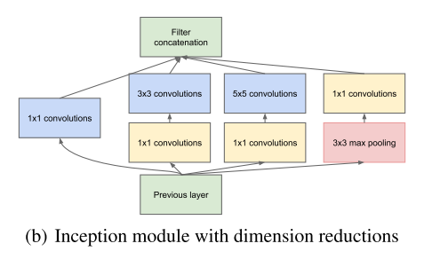

**Filter concatenation：** filter banks的简单合并，filter banks应该就是这些filters的计算结果（属于中间结果），concat后形成feature map。要说明的是卷积得到的feature map的尺寸主要取决于stride，kernel size不一样时，只需要进行 padding 补齐就可以。只要 stride 一样，最后得到的 feature map 的大小也是一样的；

论文中提到，Inception模块适合加在网络的高层，越往上层，Inception模块中的 `!$3\times 3$` 以及 `!$5\times 5$` 卷积核数量应该增加。这一点我目前认为是网络层数越高，网络输出的相关性变化，更高层捕捉到的抽象特征相对于原始输入的图像来说分布应该是越分散的，所以filter的尺寸应该相应地变大，也就是更大尺寸的filter的比例应该增加。

**1x1卷积的作用：**
 1. 降维：比如 previous layer 为 `!$56x56x64$`，不加 1x1 卷积核而直接加 128 个 5x5 卷积核时，参数量为 `!$5x5x64x128=204800$`；而先加入 32 个 1x1 卷积核再连接 128 个 5x5 卷积核时，参数量为 `!$1x1x1x64x32+5x5x32x128=104448$`
 2. 增加非线性：在使用1x1卷积后同时会使用ReLU，增强了非线性。（原理和网络加深特征表示增强同）

**疑问：为什么 `!$1\times 1$` 在池化操作的后面？（可能由于 `!$3\times 3$` 最大池化是无参操作，所以 `!$1\times 1$` 放在后面也不会增加计算量）。**

##### （二）、GoogLeNet

运用Inception单元构造成 GoogLeNet(通常说Inception网络应该就是指 GoogLeNet，GoogLeNet 是ImageNet2014 比赛的第一名，包括task1分类任务和task2检测任务。)：

1.  网络前端部分先用了几层普通的卷积模块过渡。（疑问：不明白为什么要过渡？）
2.  网络主体部分是 `!$9$` 个Inception V1单元。
3.  网络最后端是分类器单元(包括池化层和分类层)。
4.  网络附加部分又有两个分类器单元。原因有二：一是网络太深了，误差反向传递的时候对网络前端影响有限，加入的两个分类器可以防止梯度消失。二是实验表明网络中间层特征已经足够用来进行分类了，即中间分类器的分类结果可信，中间损失对参数更新有一定的指导性。

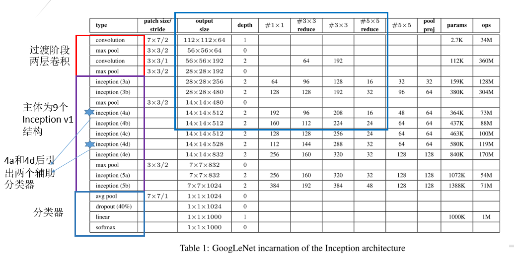

`!$\text{#}3\times 3 \text{reduce} , \text{#}5\times 5 \text{reduce}$` 指的是 3x3 和 5x5 卷积前用于降维的 1x1 卷积核的数目，和output size一列做对比，可以看出通道数明显减少，且 5x5 卷积要比 3x3 卷积通道数减少的更多。

##### （三）、Inception-BN

###### 1、针对的问题
**为什么深度神经网络随着网络深度加深，训练起来越困难，收敛越来越慢？**

训练深度神经网络的复杂性在于，每层输入的数据的分布在训练过程中会发生变化，因为前面的层的参数会发生变化。因为深层神经网络在做非线性变换前的激活输入值（就是 `!$x=WU+B$`，U是输入）随着网络深度加深或者在训练过程中，其分布逐渐发生偏移或者变动，之所以训练收敛慢，一般是整体分布逐渐往非线性函数的取值区间的上下限两端靠近（对于Sigmoid函数来说，意味着激活输入值 `!$WU+B$` 是大的负值或正值），所以这导致反向传播时低层神经网络的梯度消失，这是训练深层神经网络收敛越来越慢的本质原因。作者将这种现象称为内部协变量转移，并通过标准化层输入来解决这个问题。


之前的方法是降低学习率和仔细的参数初始化，但这会减慢训练，并且使具有饱和非线性的模型训练起来非常困难。

###### 2、思想来源
之前的研究表明如果在图像处理中对输入图像进行白化（Whiten）操作的话——所谓白化，就是对输入数据分布变换到 0均值，单位方差的正态分布——那么神经网络会较快收敛，那么可以这样想：图像是深度神经网络的输入层，做白化能加快收敛，其实对于深度网络来说，其中某个隐层的神经元是下一层的输入，意思是其实深度神经网络的每一个隐层都是输入层，不过是相对下一层来说而已，那么能不能对每个隐层都做白化呢？这就是启发BN产生的原初想法，而BN可以理解为对深层神经网络每个隐层神经元的激活值做简化版本的白化操作——归一化（比如0均值1方差化）——(白化相当于PCA加归一化，白化的计算成本太大，并且不能保证可微)

###### 3、BatchNorm的本质思想
因为深层神经网络在做非线性变换前的激活输入值（就是 `!$x=WU+B$`，U 是输入）随着网络深度加深或者在训练过程中，其分布逐渐发生偏移或者变动，之所以训练收敛慢，一般是整体分布逐渐往非线性函数的取值区间的上下限两端靠近（对于Sigmoid函数来说，意味着激活输入值 `!$WU+B$` 是大的负值或正值），所以这导致反向传播时低层神经网络的梯度消失，这是训练深层神经网络收敛越来越慢的本质原因，而BN就是通过一定的规范化手段，把每层神经网络任意神经元这个输入值的分布强行拉回到均值为 0方差为1的标准正态分布，其实就是把越来越偏的分布强制拉回比较标准的分布，这样使得激活输入值落在非线性函数对输入比较敏感的区域，这样输入的小变化就会导致损失函数较大的变化，意思是这样让梯度变大，避免梯度消失问题产生，而且梯度变大意味着学习收敛速度快，能大大加快训练速度。

其实一句话就是：对于每个隐层神经元，把逐渐向非线性函数映射后向取值区间极限饱和区靠拢的输入分布强制拉回到均值为0方差为1的比较标准的正态分布，使得非线性变换函数的输入值落入对输入比较敏感的区域，以此避免梯度消失问题。因为梯度一直都能保持比较大的状态，所以很明显对神经网络的参数调整效率比较高，就是变动大，就是说向损失函数最优值迈动的步子大，也就是说收敛地快。BN说到底就是这么个机制，方法很简单，道理很深刻。

上面说得还是显得抽象，下面更形象地表达下这种调整到底代表什么含义。

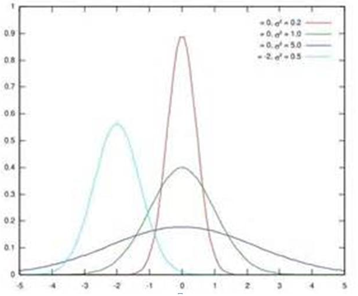

假设某个隐层神经元原先的激活输入x取值符合正态分布，正态分布均值是 -2，方差是 0.5，对应上图中最左端的浅蓝色曲线，通过BN后转换为均值为 0，方差是 1 的正态分布（对应上图中的深蓝色图形），意味着什么，意味着输入 x 的取值正态分布整体右移2（均值的变化），图形曲线更平缓了（方差增大的变化）。这个图的意思是，BN其实就是把每个隐层神经元的激活输入分布从偏离均值为 0 方差为 1 的正态分布通过平移均值压缩或者扩大曲线尖锐程度，调整为均值为 0 方差为 1 的正态分布。　　

那么把激活输入x调整到这个正态分布有什么用？首先我们看下均值为0，方差为1的标准正态分布代表什么含义：


这意味着在一个标准差范围内，也就是说 64% 的概率 x 其值落在 `!$[-1,1]$` 的范围内，在两个标准差范围内，也就是说95%的概率 x 其值落在了 `!$[-2,2]$` 的范围内。那么这又意味着什么？我们知道，激活值 `!$x=WU+B$`,U 是真正的输入，x 是某个神经元的激活值，假设非线性函数是sigmoid，那么看下 sigmoid(x) 其图形：


及sigmoid(x)的导数为：`!$G’=f(x)\times (1-f(x))$`，因为 `!$f(x)=sigmoid(x)$` 在0到1之间，所以 `!$G’$`在 0 到 0.25 之间，其对应的图如下：

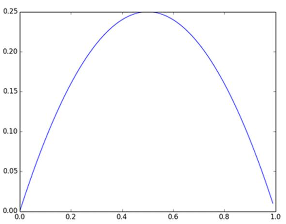

假设没有经过BN调整前x的原先正态分布均值是-6，方差是1，那么意味着95%的值落在了 `!$[-8,-4]$`  之间，那么对应的Sigmoid（x）函数的值明显接近于0，这是典型的梯度饱和区，在这个区域里梯度变化很慢，为什么是梯度饱和区？请看下sigmoid(x)如果取值接近 0 或者接近于 1 的时候对应导数函数取值，接近于0，意味着梯度变化很小甚至消失。而假设经过BN后，均值是0，方差是1，那么意味着 95% 的 x 值落在了 `!$[-2,2]$` 区间内，很明显这一段是 sigmoid(x) 函数接近于线性变换的区域，意味着x的小变化会导致非线性函数值较大的变化，也即是梯度变化较大，对应导数函数图中明显大于 0 的区域，就是梯度非饱和区。　　

从上面几个图应该看出来BN在干什么了吧？其实就是把隐层神经元激活输入 `!$x=WU+B$` 从变化不拘一格的正态分布通过BN操作拉回到了均值为0，方差为1的正态分布，即原始正态分布中心左移或者右移到以0为均值，拉伸或者缩减形态形成以 1 为方差的图形。什么意思？就是说经过BN后，目前大部分Activation的值落入非线性函数的线性区内，其对应的导数远离导数饱和区，这样来加速训练收敛过程。　　

但是很明显，看到这里，稍微了解神经网络的读者一般会提出一个疑问：如果都通过BN，那么不就跟把非线性函数替换成线性函数效果相同了？这意味着什么？我们知道，如果是多层的线性函数变换其实这个深层是没有意义的，因为多层线性网络跟一层线性网络是等价的。这意味着网络的表达能力下降了，这也意味着深度的意义就没有了。所以BN为了保证非线性的获得，对变换后的满足均值为0方差为1的x又进行了scale加上shift操作( `!$y=scale \times x+shift$` )，每个神经元增加了两个参数scale和shift参数，这两个参数是通过训练学习到的，意思是通过scale和shift把这个值从标准正态分布左移或者右移一点并长胖一点或者变瘦一点，每个实例挪动的程度不一样，这样等价于非线性函数的值从正中心周围的线性区往非线性区动了动。核心思想应该是想找到一个线性和非线性的较好平衡点，既能享受非线性的较强表达能力的好处，又避免太靠非线性区两头使得网络收敛速度太慢。当然，这是我的理解，论文作者并未明确这样说。但是很明显这里的scale和shift操作是会有争议的，因为按照论文作者论文里写的理想状态，就会又通过scale和shift操作把变换后的x调整回未变换的状态，那不是饶了一圈又绕回去原始的“Internal Covariate Shift”问题里去了吗，感觉论文作者并未能够清楚地解释scale和shift操作的理论原因。

###### 4、训练阶段如何做BatchNorm
假设对于一个深层神经网络来说，其中两层结构如下：


要对每个隐层神经元的激活值做BN，可以想象成每个隐层又加上了一层BN操作层，它位于 `!$x=WU+B$` 激活值获得之后，非线性函数变换之前，其图示如下：

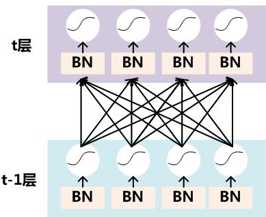

对于Mini-Batch SGD来说，一次训练过程里面包含m个训练实例，其具体BN操作就是对于隐层内每个神经元的激活值来说，进行如下变换：
```mathjax!
$$
\hat x^{(k)} = \frac{x^{(k)} - E[x^{(k)}]}{\sqrt{Var[x^{(k)}]}}
$$
```
要注意，这里t层某个神经元的 `!$x(k)$` 不是指原始输入，就是说不是 `!$t-1$` 层每个神经元的输出，而是t层这个神经元的线性激活 `!$x=WU+B$`，这里的U才是t-1层神经元的输出。变换的意思是：某个神经元对应的原始的激活x通过减去mini-Batch内 m 个实例获得的 m 个激活 x 求得的均值 `!$E(x)$` 并除以求得的方差 `!$Var(x)$` 来进行转换。

上文说过经过这个变换后某个神经元的激活x形成了均值为0，方差为1的正态分布，目的是把值往后续要进行的非线性变换的线性区拉动，增大导数值，增强反向传播信息流动性，加快训练收敛速度。但是这样会导致网络表达能力下降，为了防止这一点，每个神经元增加两个调节参数（scale和shift），这两个参数是通过训练来学习到的，用来对变换后的激活反变换，使得网络表达能力增强，即对变换后的激活进行如下的scale和shift操作，这其实是变换的反操作：
```mathjax!
$$
y^{(k)} = \gamma^{(k)} \hat x^{(k)} + \beta^{(k)}
$$
```
BN其具体操作流程，如论文中描述的一样：

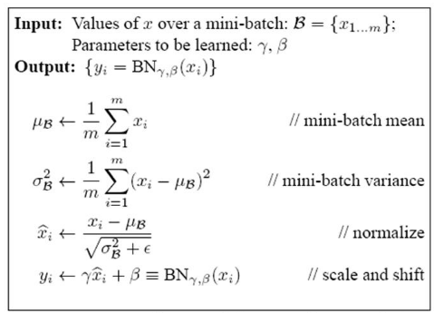

###### 5、BatchNorm的推理(Inference)过程
BN在训练的时候可以根据Mini-Batch里的若干训练实例进行激活数值调整，但是在推理（inference）的过程中，很明显输入就只有一个实例，看不到Mini-Batch其它实例，那么这时候怎么对输入做BN呢？因为很明显一个实例是没法算实例集合求出的均值和方差的。这可如何是好？

既然没有从Mini-Batch数据里可以得到的统计量，那就想其它办法来获得这个统计量，就是均值和方差。可以用从所有训练实例中获得的统计量来代替Mini-Batch里面m个训练实例获得的均值和方差统计量，因为本来就打算用全局的统计量，只是因为计算量等太大所以才会用Mini-Batch这种简化方式的，那么在推理的时候直接用全局统计量即可。

决定了获得统计量的数据范围，那么接下来的问题是如何获得均值和方差的问题。很简单，因为每次做Mini-Batch训练时，都会有那个Mini-Batch里 m 个训练实例获得的均值和方差，现在要全局统计量，只要把每个Mini-Batch的均值和方差统计量记住，然后对这些均值和方差求其对应的数学期望即可得出全局统计量，即：
```mathjax!
$$
E[x] \leftarrow E_B [\mu_B]  \\
Var[x] \leftarrow \frac{m}{m - 1}E_B [\sigma_B^2]
$$
```
有了均值和方差，每个隐层神经元也已经有对应训练好的Scaling参数和Shift参数，就可以在推导的时候对每个神经元的激活数据计算NB进行变换了，在推理过程中进行BN采取如下方式：
```mathjax!
$$
y = \frac{\gamma}{\sqrt{Var[x] + \epsilon}} \cdot x + (\beta - \frac{\gamma \cdot E[x]}{\sqrt{Var[x] + \epsilon}})
$$
```
这个公式其实和训练时：
```mathjax!
$$
y^{(k)} = \gamma^{(k)} \hat x^{(k)} + \beta^{(k)}
$$
```
是等价的，通过简单的合并计算推导就可以得出这个结论。那么为啥要写成这个变换形式呢？我猜作者这么写的意思是：在实际运行的时候，按照这种变体形式可以减少计算量，为啥呢？因为对于每个隐层节点来说：
```mathjax!
$$
\frac{\gamma \cdot E[x]}{\sqrt{Var[x] + \epsilon}}
$$
```
都是固定值，这样这两个值可以事先算好存起来，在推理的时候直接用就行了，这样比原始的公式每一步骤都现算少了除法的运算过程，乍一看也没少多少计算量，但是如果隐层节点个数多的话节省的计算量就比较多了。

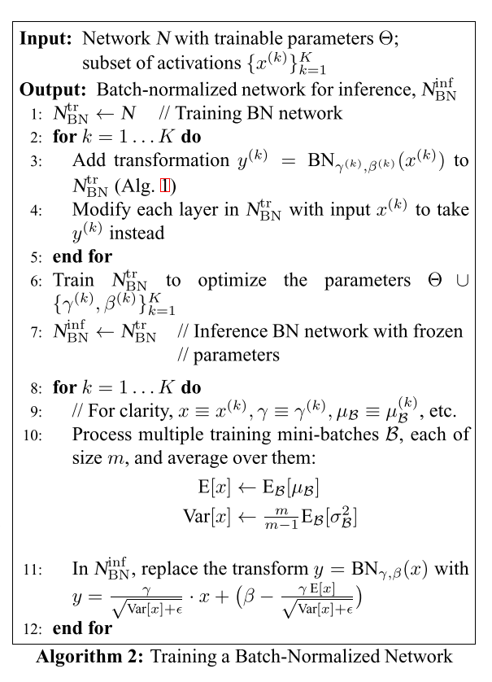

在没有采用Batch Normalization之前，激活函数是这样表达的，
```mathjax!
$$
z = g(Wu + b)
$$
```
加入Batch Normalization之后，变成
```mathjax!
$$
z = g(BN(Wu))
$$
```
因为偏置参数 b 经过BN层后其实是没有用的，最后也会被均值归一化，所以 b 就去掉了。
在卷积神经网络中Batch Normalization是以特征图为单位而不是按照各个维度。比如在某一层，batch大小为 m，特征图大小为`!$w×h$`，则做Batch Normalization的数据量为 `!$m×w×h$`。
在传统的深度神经网络中，过高的学习率会导致梯度爆炸或消失，或者取得表现不好的局部极小值。使用Batch Normalization之后可以使用很大的学习率，学习率的衰减速度也很大。即使你选择了较小的学习率，也比以前的收敛速度快。


##### （四）、分解卷积核——Inception V2（官方的版本）

###### 设计网络的四个原则

 1. 避免过度降维(会导致representational bottlenecks)，即不要让下一层网络的神经数目大幅减少。
 2. 神经网络非常善于处理高维数据，多加几层非线性网络可以是网络更好地解析复杂特征。
 3. 在 3×3 或 5×5 前，用 1×1 卷积压缩通道上的维度不会影响网络的性能。
 4. 网络的宽度和深度应该处于一个平衡的状态。

###### 1. 用两个 `!$3\times 3$` 卷积替代 `!$5\times 5$` 

* 减少了参数的数目，可以降低计算量。
* 两个堆叠 `!$3\times 3$` 获得的感受野(receptive field) 与 `!$5\times 5$` 是相同的。

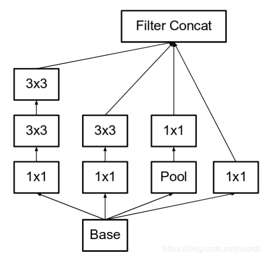

###### 2、用 `!$n\times 1$` 和 `!$1\times n$` 堆叠替代 `!$n\times n$`


###### 3、用 `!$n\times 1$` 和 `!$1\times n$` 并联替代 `!$n\times n$`


###### 4、实验用的网络整体结构


* 上表中figure5、6、7分别对应上述的 3 种卷积核的因子分解方式1、2、3。
* 上表中红框所示部分是网络的前端部分，对应第一个版本GoogLeNet的前半部分。

相对于GoogLeNet的改进：把 `!$7\times 7$` 卷积替换为 `!$3$` 个 `!$3\times 3$` 卷积。包含 `!$3$` 个Inception部分。第一部分是 `!$35\times 35\times 288$`，使用了 `!$2$` 个 `!$3\times 3$` 卷积代替了传统的 `!$5\times 5$`；第二部分减小了feature map，增多了filters，为 `!$17\times 17\times 768$`，使用了 `!$n\times 1->1\times n$` 结构；第三部分增多了filter，使用了卷积池化并行结构。网络有42层，但是计算量只有GoogLeNet的 `!$2.5$` 倍。

##### （五）、Inception V3
从提高网络分类准确率的角度重新优化了Inception v2。
**需要说明的是：从作者做实验的角度来说，Inception V1《=》GoogleNet，Inception V2 《=》上图中的网络整体结构**，下面是得到Inception V3的过程：

1. Inception V2中的优化器从moment SGD换成了RMSProp得到Inception V2 RMSProp;
2. Inception V2 RMSProp在最后计算损失阶段使用了**标签平滑正则化**(Label Smoothing Regularization)得到Inception V2 Label Smoothing;
3. Inception V2 Label Smoothing进一步**改变了Inception的结构**得到Inception V Factorized 7x7;
4. Inception V Factorized 7x7 去掉了一个附加分类器，并在另一个附加分类器中加入了BatchNorm得到Inception V2 BN-auxiliary（**这就是Inception V3**）

###### 1、类别标签平滑正则化

IncentionV3 提出一种通过估计 label-dropout 的边缘化效应(marginalized effect)来正则化分类器层的机制，即Label-smoothing Regularization，LSR。

**参数汇总：**
 `!$z_i$` - logits，未被归一化的对数概率。

 `!$p$` - predicted probability，样本的预测概率。

 `!$q$` - groundtruth probability，样本的真实类别标签概率。 one-shot 时，样本的真实概率为 Dirac 函数，即 `!$q(k) = \delta _{k, y}$`，`!$y$` 为真实的类别标签。
 
对于每个训练样本 `!$x$`，网络模型计算其关于每个类别标签 `!$k\in \{1\ldots K \}$`  的概率值，Softmax 层输出的预测概率：
```mathjax!
$$
p(k|x) = \frac{exp(z_k)}{\sum _{i=1}^K exp(z_i)}
$$
```
其中,`!$z_i$`  是 logits 或者未归一化的 log-概率值(log-probability)。

假设对该样本关于类别标签  `!$q(k|x)$` 的 ground truth 分布，进行归一化，有：
```mathjax!
$$
\sum _k q(k|x) = 1
$$
```
简单起见，忽略关于样本 `!$x$`  的 `!$p$`  和 `!$q$`  之间的依赖性。

定义样本的损失函数为交叉熵(cross entropy)：
```mathjax!
$$
\mathcal{l} = - \sum _{k=1}^K log(p(k)) q(k)
$$
```
最小化该交叉熵损失函数，等价于最大化特定类别标签的期望 log 似然值，该特定类别标签是根据其 ground truth 分布 `!$q(k)$`  选定的。

交叉熵损失函数是关于 logits `!$z_k$`  可微的，因此可以用于深度模型的梯度训练。其梯度的相对简洁形式为：
```mathjax!
$$
\frac{\partial l}{\partial z_k} = p(k) - q(k) \ \ \text{,其值区间为}[-1,1]
$$
```
假设只有单个 ground truth 类别标签 `!$y$`  的情况，则 `!$q(y)=1,q(k)=0(k\neq y)$`，此时，最小化交叉熵损失函数等价于最大化正确类别标签(correct label) 的 log-likelihood。

对于某个样本 `!$x$`，其类别标签为 `!$y$`，对 `!$q(k)$`  计算最大化 log-likelihood，`!$q(k) = \delta _{k,y}$`，`!$\delta_{k,y}$` 其中  为 Dirac 函数，即 `!$k = y$` 时，`!$\delta_{k,y} = 1$`；`!$k\neq y$` 时，`!$\delta_{k,y} = 0$`.

在采用预测的概率来拟合真实的概率时，只有当对应于 ground truth 类别标签的 logit 值远远大于其它类别标签的 logit 值时才可行。但其面临两个问题：

 - 可能导致过拟合 - 如果模型学习的结果是，对于每个训练样本都将全部概率值都分配给 ground truth 类别标签，则不能保证其泛化能力。
 - 其鼓励最大 logit 值和其它 logits 值间的差异尽可能的大，但结合梯度 `!$\frac{\partial l}{\partial z_k}$`  的有界性，其削弱了模型的适应能力。

也就是说，只有模型对预测结果足够有信心时才可能发生的情况。

InceptionV3 提出了一种机制，鼓励模型少一点自信(encouraging the model to be less confident)。

虽然，对于目标是最大化训练标签的 log-likelihoodd 的问题不是所期望的；但却能够正则化模型，并提升模型的适应能力。

假设有类别标签的分布 `!$u(k)$`，其独立于训练样本 `!$x$`，和一个平滑参数 `!$\epsilon$`，对于 ground truth 类别标签为 `!$y$` 的训练样本，将其类别标签的分布 `!$q(k|x) = \delta _{k, y}$`  替换为：
```mathjax!
$$
q^{'} (k|x) = (1 - \epsilon ) \delta _{k, y} + \epsilon u(k)
$$
```
是原始 ground truth 分布 `!$q(k|x)$` 、固定分布 `!$u(k)$` 、权重 `!$1 - \epsilon$` 和权重 `!$\epsilon$`  的组合。

可以将类别标签 `!$k$`  的分布的计算可以看作为：

 - 首先，将类别标签设为 groundtruth 类别标签，`!$k = y$`；
 - 然后，采用概率 `!$\epsilon$`  ，将从分布 `!$u(k)$`  中的采样值来取代 `!$k$`；

InceptionV3 中采用类别标签的先验分布来作为 `!$u(k)$`。 如均匀分布(uniform distribution)，`!$u(k) = \frac{1}{K}$`，则：
```mathjax!
$$
q^{'} (k|x) = (1 - \epsilon ) \delta _{k, y} + \epsilon \frac{1}{K}
$$
```
对此，称为类别标签平滑正则化(label-smoothing regularization, LSR)。

LSR 交叉熵变为：
```mathjax!
$$
H(q^{'}, p) = - \sum _{k=1} ^K log(p(k) q^{'}(k)) = (1 - \epsilon) H(q, p) + \epsilon H(u, p)
$$
```
等价于将单个交叉熵损失函数 `!$H(q,p)$`  替换为一对损失函数 `!$H(q,p)$`  和 `!$H(u,p)$`。

损失函数 `!$H(u,p)$`  惩罚了预测的类别标签分布 `!$p$` 相对于先验分布 `!$u$` 的偏差，根据相对权重 `!$\epsilon / 1 - \epsilon$`。 该偏差也可以从 KL divergence 的角度计算，因为 `!$H(u, p) = D_{KL}(u || p) + H(u)$`， `!$H(u)$` 时固定。当  `!$u$` 时均匀分布时，`!$H(u,p)$` 是评价预测的概率分布 `!$p$`  与均匀分布 `!$u$` 间的偏离程度。

**KL divergence ：** 相对熵（relative entropy），又被称为Kullback-Leibler散度（Kullback-Leibler divergence）或信息散度（information divergence），是两个概率分布（probability distribution）间差异的非对称性度量。

###### 2、降低特征图的大小

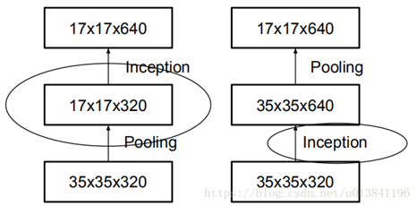

传统上，卷积网络使用一些池化操作来缩减特征图的网格大小（如图1）。但是池化操作通常都会造成特征维度的骤降，违反了“避免过度降维(导致representational bottlenecks)”原则。图中，左边的解决方案表示能力较弱，右边的计算量比较大（是左边的四倍）。


采用图2中的方法降低不同 Inception 模块间的网格尺寸。在 Inception 模块内部，采用 0-padding 的卷积来保持网格尺寸。卷积(conv)的步长是2，池化(pool)的步长是2。

###### 3、使用辅助分类器
Inception V1(GoogLeNet)引入了辅助分类器的概念，当时的设计目的是：

 - 把梯度有效的传递回去，不会有梯度消失问题，加快了训练
 - 中间层的特征也有意义，空间位置特征比较丰富，有利于提成模型的判别力

在Inception V2的实验中发现辅助分类器在训练早期并没有导致改善收敛：在两个模型达到高精度之前，有无侧边网络的训练进度看起来几乎相同。接近训练结束，辅助分支网络开始超越没有任何分支的网络的准确性，达到了更高的稳定水平。 

**Inception V2的改进：**

移除下面的一个辅助分类器。根据对实验结果的观察，这意味着这些分支有助于演变低级特征很可能是不适当的（推翻了Inception V1中对辅助分类器的认知）。相反，我们认为辅助分类器起着正则化项的作用，因为实验发现如果侧分支是批标准化的（BN）或具有丢弃层（Dropout），则网络的主分类器性能更好。这也为推测BN有正则化作用提供了一个弱支持证据。

##### （六）、Inception V4
Inception V4相对于Inception V3的改变没有理论说明，主要是为了与引入残差结构的网络做对比实验，需要注意的一点是Inception V1-V3的结构设计有限制，因为在训练网络的时候，整个结构要copy到多台机器上跑，每台机器跑其中的一部分结构，所以结构设计要考虑到模块化。而Inception V4在设计的时候放开了这些约束，所以看起来有些随意。

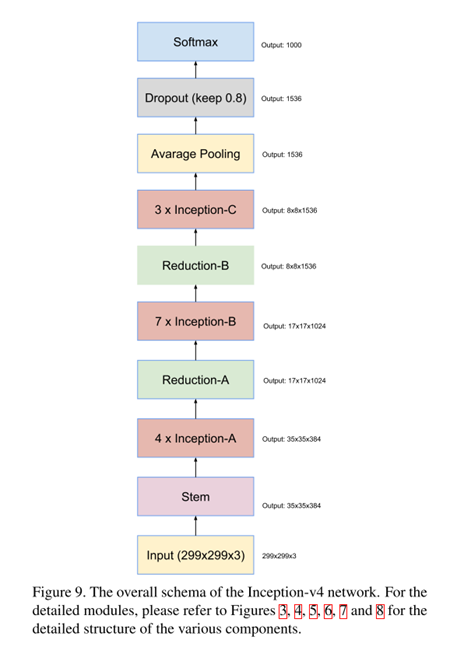

#### 二、ResNet
##### 1、针对的问题

随着网络的加深，因为存在梯度消失和梯度爆炸问题，容易出现训练集准确率下降的现象，并且不是过拟合造成的(过拟合的情况训练集应该准确率很高)。

通过在一个浅层网络基础上叠加 `!$y=x$` 的层（称identity mappings，恒等映射），可以让网络随深度增加而不退化。这反映了多层非线性网络无法逼近恒等映射网络。

##### 2、残差学习

Resnet学习的是残差函数 `!$F(x) = H(x) - x$`, 这里如果 `!$F(x) = 0$`，那么就是上面提到的恒等映射。事实上，Resnet是“shortcut connections”的connections在恒等映射下的特殊情况，它没有引入额外的参数和计算复杂度。 假如优化目标函数是逼近一个恒等映射, 而不是 `!$0$` 映射，那么学习找到对恒等映射的扰动 `!$(F(x))$` 会比重新学习一个映射函数要容易。

##### 3、残差块

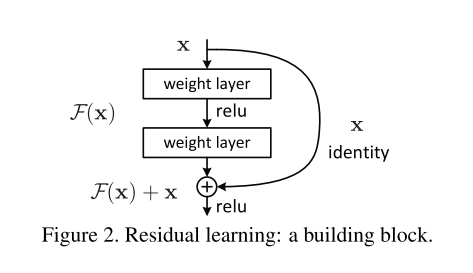

ResNet提出了两种mapping：

1. 一种是identity mapping，指的就是图中”弯弯的曲线”，这种连接方式叫做“shortcut connection”。
2. 一种residual mapping，指的就是除了”弯弯的曲线“那部分，所以最后的输出是 `!$y = F(x) + x$` 。

identity mapping，就是指本身，也就是公式中的 `!$x$`，而residual mapping指的是“差”，也就是 `!$y − x$`，所以残差指的就是 `!$F(x)$` 部分。

图中的残差结构有二层，如下表达式，其中 `!$\sigma $` 代表非线性函数ReLU：
```mathjax!
$$
F = W_2 \sigma(W_1 x)
$$
```
然后通过一个shortcut，和第 2 个ReLU，获得输出 `!$y$`
```mathjax!
$$
y = F(x,\{W_i\}) + x \ \ .
$$
```
当需要对输入和输出维数进行变化时（如改变通道数目），可以在shortcut时对 `!$x$` 做一个线性变换 `!$W_s$`，如下式：
```mathjax!
$$
y = F(x,\{W_i\}) + W_s x \ \ .
$$
```
或者，用 `!$0$` 补齐。（作者对两种方式都做了实验）

然而实验证明 `!$x$` 已经足够了，不需要再进行维度变换，除非需求是某个特定维度的输出，如论文中34 层的 Resnet 网络结构图中的虚线，是将通道数翻倍。

##### 4、改进

实际中，考虑计算的成本，对残差块做了计算优化，即将两个 `!$3\times 3$` 的卷积层替换为 `!$1\times 1 + 3\times 3 + 1\times 1$`，如下图。新结构中的中间 `!$3\times 3$` 的卷积层首先在一个降维 `!$1\times 1$` 卷积层下减少了计算，然后在另一个 `!$1\times 1$` 的卷积层下做了还原，既保持了精度又减少了计算量。


这两种结构分别针对ResNet34（左图）和ResNet50/101/152（右图），一般称整个结构为一个”building block“。其中右图又称为”bottleneck design”，目的就是为了降低参数的数目，第一个 `!$1\times 1$` 的卷积把 `!$256$` 维channel降到 `!$64$` 维，然后在最后通过 `!$1\times 1$` 卷积恢复，整体上用的参数数目：`!$1\times 1\times 256\times 64 + 3\times 3\times 64\times 64 + 1\times 1\times 64\times 256 = 69632$`，而不使用bottleneck的话就是两个 `!$3\times 3\times 256$` 的卷积，参数数目: `!$3\times 3\times 256\times 256\times 2 = 1179648$`，差了 `!$16.94$` 倍。

论文作者的观点：对于常规ResNet，可以用于34层或者更少的网络中，对于Bottleneck Design的ResNet通常用于更深的如 101 这样的网络中，目的是减少计算和参数量。


#### 三、DenseNet
DenseNet脱离了加深网络层数(ResNet)和加宽网络结构(Inception)来提升网络性能的定式思维，从特征的角度考虑，通过特征重用和旁路(Bypass)设置，既大幅度减少了网络的参数量，又在一定程度上缓解了gradient vanishing问题的产生。

##### 1、Dense connectivity

假设输入为一个图片 `!$X_0$`，经过一个 `!$L$` 层的神经网络， 其中第 `!$i$` 层的非线性变换记为 `!$H_i(.)$` 。`!$H_i(.)$` 可以是多种函数操作的累加，如 BN、ReLU、Pooling或Conv等。第 `!$i$` 层的特征输出记作 `!$X_i$`。

**ResNet：** 
传统卷积前馈神经网络将第 `!$l$` 层的输出 `!$x_l $`
作为 `!$l + 1$` 层的输入,可以写作 `!$x_l = H_l(x_{l - 1})$`。
ResNet增加了旁路连接,可以写作 `!$x_l = H_l(x_{x - 1}) + x_{x - 1}$`
ResNet的一个最主要的优势便是梯度可以流经恒等函数来到达靠前的层。但恒等映射和非线性变换输出的叠加方式是相加, 这在一定程度上破坏了网络中的信息流。

**DenseNet：**
为了进一步优化信息流的传播，DenseNet提出了图示的网络结构：


第 `!$l$` 层的输入不仅与 `!$l - 1$` 层的输出相关，还有所有之前层的输出有关。记作：
```mathjax!
$$
x_l = H_l([x_0,x_1,\ldots ,x_{l - 1}])
$$
```

其中 `!$[]$` 代表 concatenation(拼接)，既将 `!$X_0$` 到 `!$X_{l - 1}$` 层的所有输出feature map按Channel组合在一起。这里所用到的非线性变换 Hl 为BN+ReLU+ Conv(3×3)的组合。

##### 2、Composite function
非线性变换 `!$H_l$` 为 `!$BN+ReLU+ Conv(3×3)$` 的组合。


##### 3、过渡层（Transition Layer）
过渡层包含瓶颈层（bottleneck layer，即 `!$1\times 1$` 卷积层）和池化层。

###### 1)、Pooling layers
由于在DenseNet中需要对不同层的 feature map 进行 cat 操作，所以需要不同层的feature map保持相同的feature size，这就限制了网络中 Down sampling 的实现。为了使用 Down sampling，作者将 DenseNet 分为多个Dense block，如下图所示：


在同一个 Dense block 中要求 feature size 保持相同大小，在不同Dense block之间设置 transition layers 实现 Down sampling, 在作者的实验中 transition layer 由 `!$BN + Conv(1\times 1) ＋(2\times 2) average-pooling$` 组成。

###### 2)、Bottleneck layers
虽然DenseNet接受较少的k（feature map的数量）作为输出，但由于不同层 feature map 之间由 cat 操作组合在一起，最终仍然会是feature map的channel较大而成为网络的负担。作者在这里使用 `!$1×1$` Conv(Bottleneck) 作为特征降维的方法来降低channel数量，以提高计算效率。经过改善后的非线性变换变为 `!$BN-ReLU-Conv(1×1)-BN-ReLU-Conv(3×3)$`。在实验中使用 Bottleneck layers 的 DenseNet 被称为DenseNet-B。

##### 4、Growth rate
在Dense block中,假设每一个非线性变换 `!$H$` 的输出为 `!$K$` 个feature map, 那么第 `!$i$` 层网络的输入便为 `!$K_0 + (i-1)\times K$`, `!$K_0$` 为输入层的通道数，这里我们可以看到DenseNet 和现有网络的一个主要的不同点：DenseNet 可以接受较少的特征图数量作为网络层的输出。

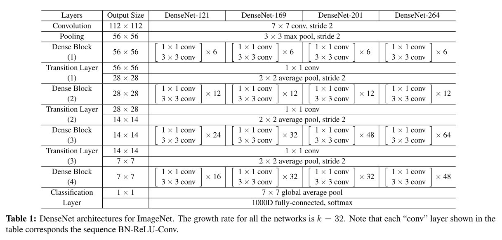

原因就是在同一个Dense block中的每一层都与之前所有层相关联，如果我们把 feature 看作是一个Denseblock的全局状态，那么每一层的训练目标便是通过现有的全局状态，判断需要添加给全局状态的更新值。因而每个网络层输出的特征图数量 `!$K$` 又称为Growth rate，同样决定着每一层需要给全局状态更新的信息的多少。在作者的实验中只需要较小的 `!$K$` 便足以实现 state-of-art 的性能。

##### 5、Compression
为了进一步优化模型，可以在 transition layer 中降低 feature map 的数量。若一个 Dense block 中包含 `!$m$` 个 feature maps，使其输出连接的 transition layer 层生成 ⌊θm⌋ 个输出feature map。其中 `!$\theta $` 为Compression factor，当 `!$\theta=1$` 时，transition layer 将保留原 feature 维度不变。在实验中使用compression且 `!$\theta =0.5$` 的 DenseNet 命名为 DenseNet-C，将使用Bottleneck和compression且 `!$\theta=0.5$` 的DenseNet命名为 DenseNet-BC。

##### 6、特点
DenseNet作为拥有较深层数的卷积神经网络，具有如下优点：

1. 相比 ResNet 拥有更少的参数数量。
2. 旁路加强了特征的重用。
3. 网络更易于训练，并具有一定的正则效果。
4. 缓解了 gradient vanishing 和 model degradation 的问题。

