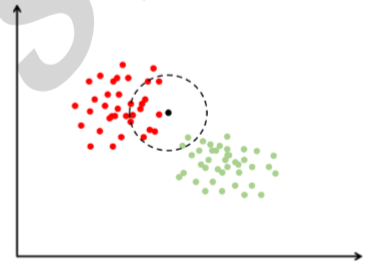

#### 1、基本要素
k近邻法（k-nearest neighbor, kNN）是一种基本分类与回归方法，由 Thomas 等人在 1967 年提出。它基于以下思想：要确定一个样本的类别，可以计算它与所有训练样本的距离，然后找出和该样本最接近的 k 个样 本，统计这些样本的类别进行投票，票数最多的那个类就是分类结果。因为直接比较样本和 训练样本的距离，kNN 算法也被称为基于实例的算法。 

k近邻法的基本做法是：给定测试实例，基于某种距离度量找出训练集中与其最靠近的 k 个实例点，然后基于这 k 个最近邻的信息来进行预测。通常，在分类任务中可使用“投票法”，即选择这 k 个实例中出现最多的标记类别作为预测结果；在回归任务中可使用“平均法”，即将这 k 个实例的实值输出标记的平均值作为预测结果；还可基于距离远近进行加权平均或加权投票，距离越近的实例权重越大。k 近邻法不具有显式的学习过程，事实上，它是懒惰学习（lazy learning）的著名代表，此类学习技术在训练阶段仅仅是把样本保存起来，训练时间开销为零，待收到测试样本后再进行处理。



在上图中有红色和绿色两类样本。对于待分类样本即图中的黑色点，我们寻找离该样本最近的一部分训练样本，在图中是以这个矩形样本为圆心的某一圆范围内的所有样本。然后 统计这些样本所属的类别，在这里红色点有 12 个，圆形有 2 个，因此把这个样本判定为红 色这一类。上面的例子是二分类的情况，我们可以推广到多类，k 近邻算法天然支持多类分 类问题。 

**距离度量、k值的选择及分类决策规则**是k近邻法的三个基本要素。根据选择的距离度量（如曼哈顿距离或欧氏距离），可计算测试实例与训练集中的每个实例点的距离，根据k值选择k个最近邻点，最后根据分类决策规则将测试实例分类。

###### 1.1、距离度量
特征空间中的两个实例点的距离是两个实例点相似程度的反映。K 近邻法的特征空间一般是 n 维实数向量空间 `!$R_n$`。使用的距离是欧氏距离，但也可以是其他距离，如更一般的 `!$L_p$` 距离或Minkowski距离。

设特征空间 X 是 n 维实数向量空间 `!$R_n,x_i,x_j \in X$`，`!$ x_i = (x_i^{(1)},x_i^{(2)},\cdots ,x_i^{(n)})^T, x_j = (x_j^{(1)},x_j^{(2)},\cdots ,x_j^{(n)})^T， x_i,x_j$` 的 `!$L_p $` 距离定义为：
```mathjax!
$$
L_p(x_i,x_j) = (\sum_{l = 1}^n | x_i^{(l)} - x_j^{(l)} |^P)^{\frac 1 P}
$$
```
这里 `!$p \ge 1$`。

当 `!$p=1$` 时，称为曼哈顿距离（Manhattan distance），即：
```mathjax!
$$
L_1(x_i,x_j) = \sum_{l = 1}^n | x_i^{(l)} - x_j^{(l)} |
$$
```
当 `!$p=2$` 时，称为欧氏距离（Euclidean distance），即：
```mathjax!
$$
L_2(x_i,x_j) = (\sum_{l = 1}^n | x_i^{(l)} - x_j^{(l)} |^2)^{\frac 1 2}
$$
```
当 `!$p=\infty$` 时，它是各个坐标距离的最大值，即：
```mathjax!
$$
L_{\infty}(x_i,x_j) = max_l|x_i^{(l)} - x_j^{(l)}|
$$
```
证明：
以二维实数向量空间（n=2）为例说明曼哈顿距离和欧氏距离的物理意义。
① 曼哈顿距离
 ```mathjax!
 $$
 L_1(x_i,x_j) = \sum_{l=1}^2|x_i^{(l)} - x_j^{(l)}| = |x_i^{(1)} - x_j^{(1)}| + |x_i^{(2)} - x_j^{(2)}| 
 $$
```
 图中绿色线即曼哈顿距离物理意义，其中横向线条表示 `!$|x^1_i-x^1_j|$`，竖向线条表示 `!$|x^2_i-x^2_j|$`。
② 欧氏距离
 ```mathjax!
 $$
L_2(x_i,x_j) = (\sum_{l = 1}^2 | x_i^{(l)} - x_j^{(l)} |^2)^{\frac 1 2} = \sqrt[2]{|x_i^{(1)} - x_j^{(1)}|^2 + |x_i^{(2)} - x_j^{(2)}|^2}
 $$
```
图中红色线即欧氏距离物理意义，根据勾股定理可得。


###### 1.2、k值的选择
k 值的选择会对 k 近邻法的结果产生重大影响。在应用中，k 值一般取一个比较小的数值，通常采用交叉验证法来选取最优的 k 值。

###### 1.3、分类决策规则
k 近邻法中的分类决策规则往往是多数表决，即由输入实例的 k 个邻近的训练实例中的多数类，决定输入实例的类。